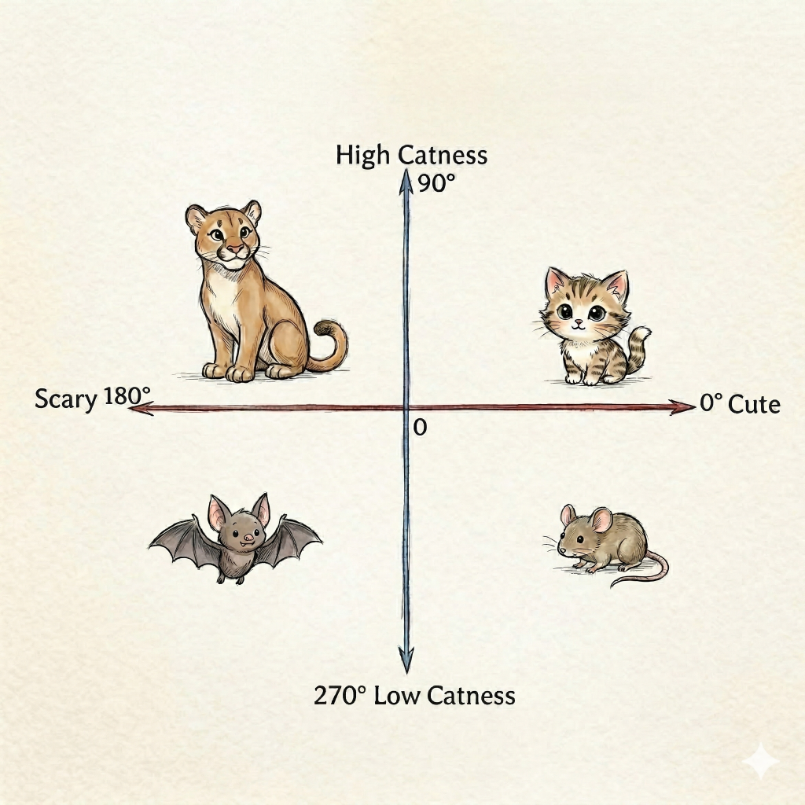
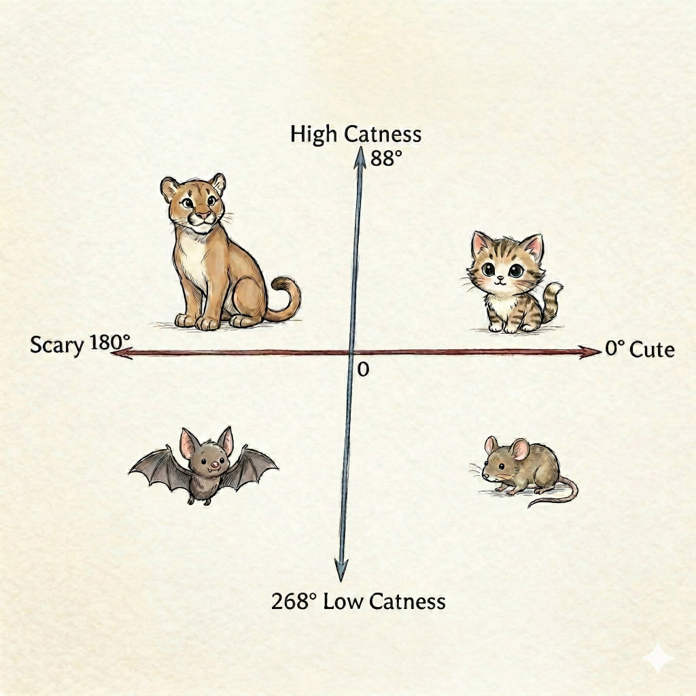
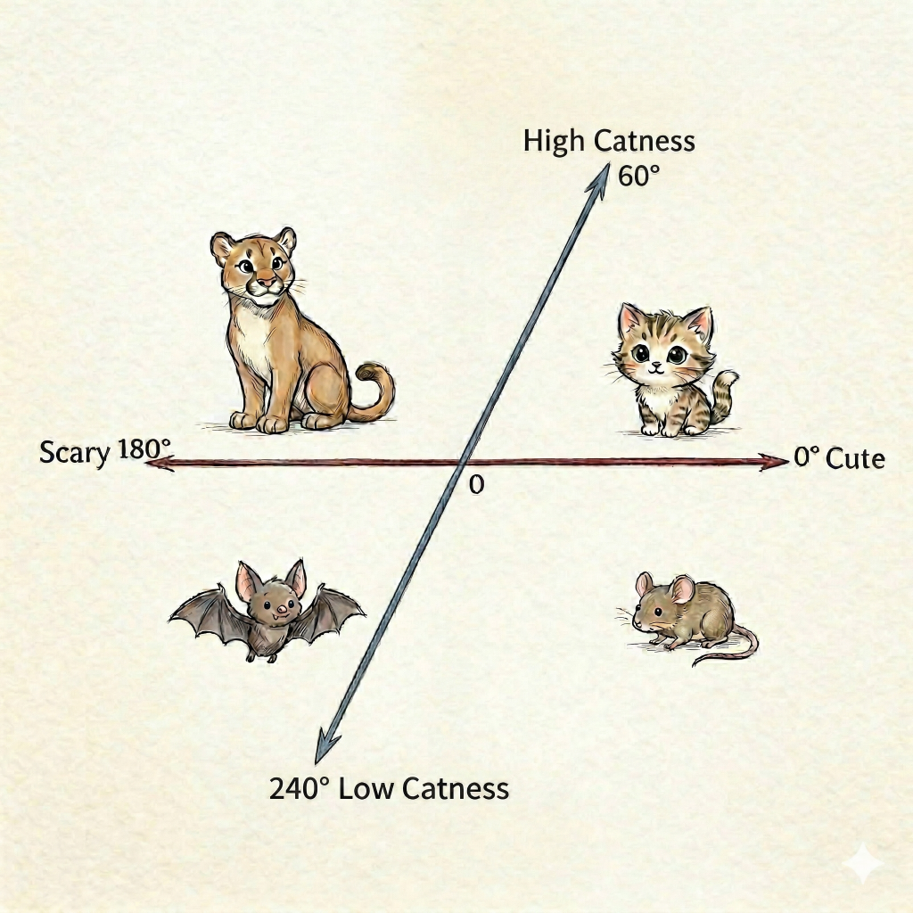
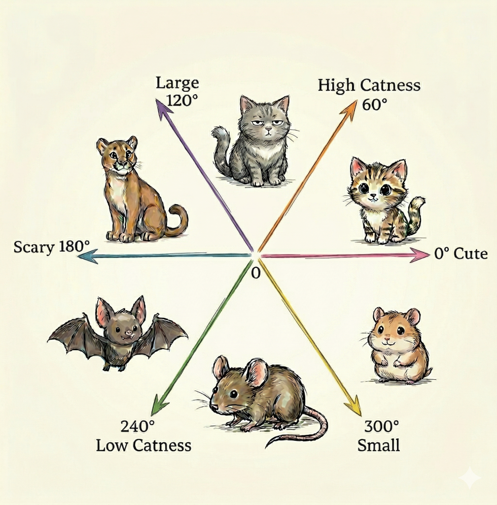
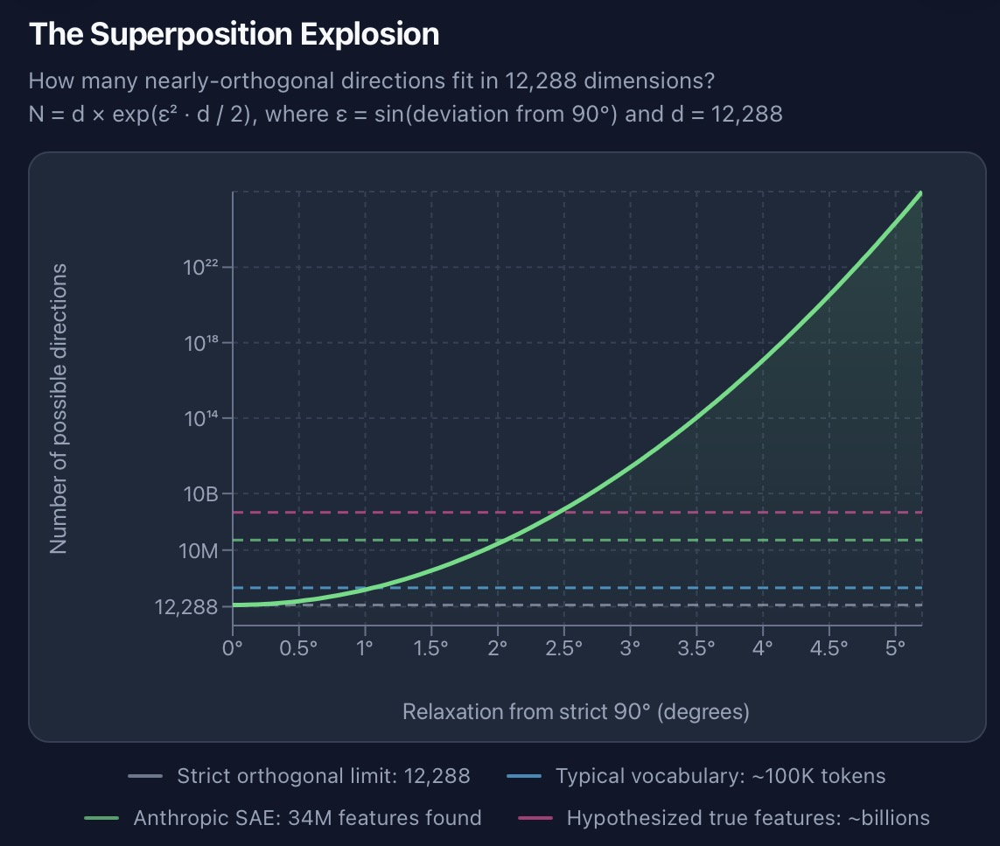

### Right here and now

* Right here ... *and*
* Right here *and* ... *now*
* Right here *and* *now*, your brain ... *is*
* Right here *and* *now*, your brain *is* predicting ... *the*
* Right here *and* *now*, your brain *is* predicting *the* ... *next*
* Right here *and* *now*, your brain *is* predicting *the* *next* ... *word*
* Right here *and* *now*, your brain *is* predicting *the* *next* *word* before ... *it*
* Right here *and* *now*, your brain *is* predicting *the* *next* *word* before *it* ... *leaves*
* Right here *and* *now*, your brain *is* predicting *the* *next* *word* before *it* *leaves* ... *my*
* Right here *and* *now*, your brain *is* predicting *the* *next* *word* before *it* *leaves* *my* ... *mouth*

### Right here and now

* Right here ___
* Right here *and* ____
* Right here *and* *now*, your brain ____
* Right here *and* *now*, your brain *is* predicting ____
* Right here *and* *now*, your brain *is* predicting *the* ____
* Right here *and* *now*, your brain *is* predicting *the* *next* ____
* Right here *and* *now*, your brain *is* predicting *the* *next* *word* before ____
* Right here *and* *now*, your brain *is* predicting *the* *next* *word* before *it* ____
* Right here *and* *now*, your brain *is* predicting *the* *next* *word* before *it* *leaves* *my* ____
* Right here *and* *now*, your brain *is* predicting *the* *next* *word* before *it* *leaves* *my* *mouth*

### I bet you can predict the next word

1. Once upon a ___  

2. 1000 × 1000 is ___  

3. Friend: Knock knock
You: ___  

4. Tourist: What's the capital of Japan?
Guide: Tokyo.
Tourist: What language do they speak there?
Guide: ___

---

---

---

---

---

### "I'm gonna stop you right there..."

When you hear people say this, it's ... just not true:
&nbsp;
_"I ran the AI on the source code ..."_
Questionable, because the AI will not fit "all the source code" in the context
&nbsp;
_"It has access to our marketing space in Confluence so it knows all about..."_
No. It can fetch from Confluence, yes, but the context doesn't hold all docs
&nbsp;
_"Maybe it remembered from earlier that..."_
Maybe. But only if that "thing from earlier" has somehow been put into the context
&nbsp;
_"It seem to become better at ..."_
Maybe. But only those improvements has somehow been put into the context

### Top 8 take-aways

* The LLMs knowledge itself is fixated after training
* The context is *ALL* the LLM knows about; if it's not in the context then the LLM does not know about it.
* Every time you send a prompt, the entire chat is re-processed
* &nbsp;
* &nbsp;
* &nbsp;
* &nbsp;
* &nbsp;
* &nbsp;

