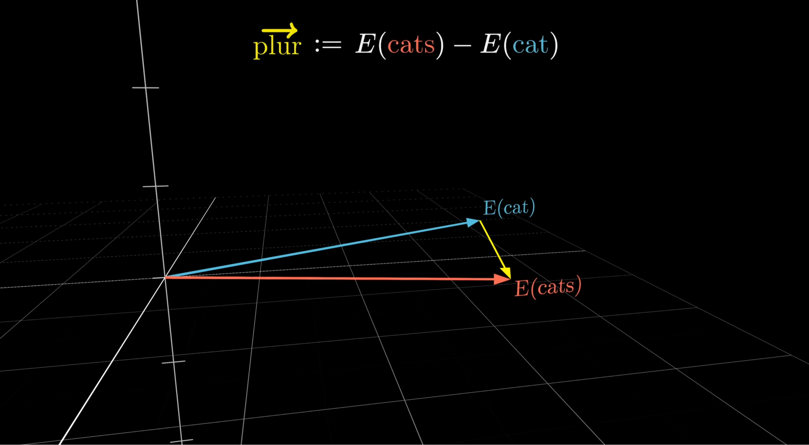

### Right here and now

* Right here ... *and*
* Right here *and* ... *now*
* Right here *and* *now*, your brain ... *is*
* Right here *and* *now*, your brain *is* predicting ... *the*
* Right here *and* *now*, your brain *is* predicting *the* ... *next*
* Right here *and* *now*, your brain *is* predicting *the* *next* ... *word*
* Right here *and* *now*, your brain *is* predicting *the* *next* *word* before ... *it*
* Right here *and* *now*, your brain *is* predicting *the* *next* *word* before *it* ... *leaves*
* Right here *and* *now*, your brain *is* predicting *the* *next* *word* before *it* *leaves* ... *my*
* Right here *and* *now*, your brain *is* predicting *the* *next* *word* before *it* *leaves* *my* ... *mouth*

### Right here and now

* Right here ___
* Right here *and* ____
* Right here *and* *now*, your brain ____
* Right here *and* *now*, your brain *is* predicting ____
* Right here *and* *now*, your brain *is* predicting *the* ____
* Right here *and* *now*, your brain *is* predicting *the* *next* ____
* Right here *and* *now*, your brain *is* predicting *the* *next* *word* before ____
* Right here *and* *now*, your brain *is* predicting *the* *next* *word* before *it* ____
* Right here *and* *now*, your brain *is* predicting *the* *next* *word* before *it* *leaves* *my* ____
* Right here *and* *now*, your brain *is* predicting *the* *next* *word* before *it* *leaves* *my* *mouth*

### I bet you can predict the next word

1. Once upon a ___  

2. 1000 × 1000 is ___  

3. Friend: Knock knock
You: ___  

4. Tourist: What's the capital of Japan?
Guide: Tokyo.
Tourist: What language do they speak there?
Guide: ___

---

---

---

---

---

### "I'm gonna stop you right there..."

When you hear people say this, it's ... just not true:
&nbsp;
_"I ran the AI on the source code ..."_
Questionable, because the AI will not fit "all the source code" in the context
&nbsp;
_"It has access to our marketing space in Confluence so it knows all about..."_
No. It can fetch from Confluence, yes, but the context doesn't hold all docs
&nbsp;
_"Maybe it remembered from earlier that..."_
Maybe. But only if that "thing from earlier" has somehow been put into the context
&nbsp;
_"It seem to become better at ..."_
Maybe. But only those improvements has somehow been put into the context

### Top 8 take-aways

* The LLMs knowledge itself is fixated after training
* The context is *ALL* the LLM knows about; if it's not in the context then the LLM does not know about it.
* Every time you send a prompt, the entire chat is re-processed
* &nbsp;
* &nbsp;
* &nbsp;
* &nbsp;
* &nbsp;
* &nbsp;

## Why

You can bake lovely crunchy bread without knowing squat about what "yeast" actually does. You add it, then set the clock to let the dough rise for 1 hour as the recipe says. The bread probably comes out fine.

But. If you know that yeast is a living organism that use enzymes to feed on sugar in the flour then the whole thing becomes demystifed. Still complex, sure, but you can now begin to understand how the choice of flour, additives, and temperature over time affect the dough and how to make deliberate choices to "steer" the dough better. For e.g. a "cold ferment" you let the yeast work normally for an hour and then place the dough in the fridge to put the yeast to sleep and let the enzymes continue to work on building flavor and gluten. A lot of advanced baking processes can seem arbitrary or magical ("add diastatic malt powder to ...") but armed with a fundamental understanding of the way yeast and enzymes works you're much better equipped to understand them - and steer them your own way, too.

This presentation is not just about the yeast and enzymes of AI, but "all of AI": from tokens and LLM to agent-files and MCP-servers. It will be deep, entertaining, useful, and surprising. Be prepared to stay alert, because there's a lot to cover. It's my hope and goal that if you digest it well then you'll rise (haha) to become much more confident in your use of AI.

(If the above feels unusual in tone and cadence then it's likely because it's written exclusively by me, a human, without any AI sparring or guidance, except for research regarding facts about yeast and enzymes)

We're all using AI. 

You sort of know how it works and can do.

And yet - there's a lot of AI mysticism at play, right?

You hear this very often:

* Just feed the entire codebase the AI and let it figure it out
* Point it to Confluence
* Install an MCP server - or a skill, or write an agent.md file
* "Don't say place" - or "Do say please"
* It's very useful to convert your PDFs to markdown before handing it to the AI
* I think it somehow knows to ...
* I think it doesn't know...

I'm here with the grand goal of demystifying the AI.

nstead my GOAL is that you will all become more confident with the terms and the fundamental principles of how the AI works so you're all better equipped to work with AI. Not the math, don't worry. I'll focus on facts that are useful for grasping the principles - which very often are surprising too.

A tour of how modern AI actually works - tokens, embeddings, LLM, context, modes, thinking, MCP-servers, skills, agent-files - and more.
  
 
 There's no math, and it is not as dry as it sounds: understanding what a token really is changes how you write prompts and why you pay what you pay; embeddings turn out to be the secret behind almost everything interesting AI can do. And when we're done, MCP servers and Claude skills will no longer be magic words — you'll just get why they work the way they do.

Links to the most interesting bits.

Now, originally I planned to giving an overview of the entire landscape of available AI tools. But it's vast and constantly moving so instead I decided to hone in on the much simpler parts: just the core steady inner parts. Which of course turned out to be filled with big rabbit holes.

So, I am not going to talk about workflow of the week, or openclaw, or that latest new command.

Instead my GOAL is that you will all become more confident with the terms and the fundamental principles of how the AI works so you're all better equipped to work with AI. Not the math, don't worry. I'll focus on facts that are useful for grasping the principles - which very often are surprising too.

After this talk you'll know much better what exactly these are: tokens, embeddings, LLM, context, AI-models, modes, thinking, agent-files, skills, tools, MCP-servers - and more.
Everything is still going to revolve around tokens and llm for the freseable future. And the constraints they bring with them also isn;t gong away. 
Anthropic just released Fable. If you look back at this talk in a year then you'll think, oh yeah, Fable, old hat now - but the underlying principles are still valid and useful to know about> Well, prove me wrong in a year. Even with progress in computing and cloud etc it's still useful to know about .... how a computer works? Fable has quantitatively become better at reasoning, it's way of juggling tools have improved, but the underlying principles and costs remain.
On that note, one caveat. I'll simplify some parts. Some AI services may do some part a bit differently. But it's been thoroughly vetted to hold up in principle and overall in practice.

Who's the intended audience? Ambitiuosly, everybody. Tech and non-tech.

There's a lot to take in. You may be thinking "hang on, that can't be right" or "I don't get it!". Feel free to ask questions during the talk. And afterwards, go checkout the slides which are on github and has links to related materials. And not least: ask me or other colleagues if you've got questions. I can elaborate on everything I'm presenting here today.

I feel like a kid in a candy store. Like when I first learned about Java and C# and bytecode.

I've learned a lot. But much more than what I could tell [big puzzle].
Prepping for this talk has helped me refine my understanding: sharpening and checking up on the fcts, ant not least extract those subconscious mental models I'd formed and figure out how to convey them in a way that can feels relevant and useful to you so you actually understand the significance, leading you to become better at wielding AI. Nothing would be easier than just walking through a jungle of facts like some misguided tour-guide - I'm trying to flesh it out in a story our caveman brainss can latch onto - hmmm.

This has been a super-challenging tech-talk to make. Because you all know about the subject, some know some parts better than me likely, and "everybody" is interested. There's just a ton to talk about, and I shouldn't tell you anything wrong, and and and.

Maybe a bit like hearing about how a car works when all you want to do is take a camping-trip to Italy. But this can help you understand why the engine overheats in that slow queue up the mountain.

### AI model ⩵ LLM

Our focus is on **AI models** that generate text. Not images, audio, etc.

All such modern AI models are built as a **Large Language Model**, aka an **LLM**.

In practice the words are synonymous: **AI Model ⩵ LLM**

 

####
 I tend to often use the word "LLM" when pointing to a specific box on a diagram or technical details and "the AI model" when talking about its behavior, but it varies.

If we're nitpicking the synonym-claim then yeah, it more correct to say that "an LLM is an AI model" and "all the current AI models used for generating text (ChatGPT, Claude, Gemini, etc) are LLMs".

### "Just a fancy autocomplete" is ...true

 

Maybe a bit like hearing about how a car works when all you want to do is take a camping-trip to Italy. But this can help you understand why the engine overheats in that slow queue up the mountain.

### The LLM

####
This journey has given me many eye-opening insights and a better grasp of AI that I wish for others to have too. AI and the tooling is surrounded by a lot of mysticisim. Nearly daily at work I hear some misconception or myth and it can be hard to gauge.

### The AI Service

####
This journey has given me many eye-opening insights and a better grasp of AI that I wish for others to have too. AI and the tooling is surrounded by a lot of mysticisim. Nearly daily at work I hear some misconception or myth and it can be hard to gauge.

---

####
This journey has given me many eye-opening insights and a better grasp of AI that I wish for others to have too. AI and the tooling is surrounded by a lot of mysticisim. Nearly daily at work I hear some misconception or myth and it can be hard to gauge.

TODO: image, maybe beans, espresso and coffee-making?

First part: set the stage

Second part: understand all the tech.

Third part: now that you understand all the tech, how do you best wield it?

# AI overview

This would be so much easier if it was about Quantum Computing because then nobody would know if I was bullshitting.

It that has actually been But what has been most challenging 
 In particular it's been challenging

How do I cram "all of AI" into one presentation? In particular on a topic you all know about and "everybody" is interested in?

It would be so much easier to present eg Quantum Computing which very few really knows about anyway.

It would also be so easy to just throw tecnical descriptions at you and expect it to stick. What made creating this presentation challenging, but also rewarding for me personally, has been figuring out all the details and how best to present them as a journey through the AI landscape that highlight the most relevant and useful bits. The bits that has helped making it click for me.

While keeping it appropriately deep and not tell you anything wrong. I've simplifed some aspects and some AI services likely does x and y a bit differently, but it's as correct as I could possibly make it.

---
### My goal: for everybody to level-up

"Is this for me?", you ask. Yes, it's for everybody, because everybody uses AI

My grand GOAL is "demystifying the AI". I hope that you will all become more familiar with the terms and the fundamental principles of how the AI works so you're all better equipped to work with AI.

####
Much of what I've learned has been truly eye-opening insights. They've given me a better grasp of AI that I wish for others to have too. Not the latest Claude slash-command, but instead the fundamentals. AI is still going to revolve around tokens and LLMs for the freseable future and their cost and limitations will still be around in a year but the fundamental parts that will still be . "skill of the day". No, the basics. The basic has given me a grounding for a better understanding of the hype of the day.
The basic behavior is so-so known but still surrounded by a lot of mysticisim. Nearly daily I hear speculations or misunderstandings that ultimately come from folks not knowing something quite basic.

####
That's the initiating? for this talk.

Prepare for a eye opening insights

https://medium.com/codandotv/does-caveman-actually-save-tokens-i-built-a-benchmark-to-find-out-469c8047c75d

---

####

There's a ton of things related to AI. Lots of math, new stuff every week, the latest Claude slash-command. That's not what this presentation is about. This is about the steady? mechanisms and building blocks mental models that I amd at demystifying. Everything is still going to revolve around tokens and LLMs for the freseable future and their cost and limitations will still be around in a year - "he said, over-confidently". So this presentation will only be about those basic building blocks. a chatbot generative text AI

---

####
However, each of every one of them are rabbit holes in their own right.

TODO: Image of checklist/bingo: .
###

It's about Large Language Models (LLMs) which generate text, ie - "chatbots".
Not eg AlphaGo / AlphaZero — plays Go/chess by playing millions of games against itself, Speech recognition — Whisper, image generation stable DiffusionDenoise toward structure
####
ImageNet / CNNs (AlexNet 2012) — the "big bang" moment; convolutional nets suddenly beating humans on image classification

## The presentation
TODO: image
How do I cram "all of AI" into one presentation? In particular on a topic you all know about and "everybody" is interested in?

It would be so much easier to present eg Quantum Computing which very few really knows about anyway.

It would also be so easy to just throw tecnical descriptions at you and expect it to stick. What made creating this presentation challenging, but also rewarding for me personally, has been figuring out all the details and how best to present them as a journey through the AI landscape that highlight the most relevant and useful bits. The bits that has helped making it click for me.

While keeping it appropriately deep and not tell you anything wrong. I've simplifed some aspects and some AI services likely does x and y a bit differently, but it's as correct as I could possibly make it.

## AI Service is a big backend service
Just like any big SaaS-company's services, it runs on some data center somewhere.

### The AI service, after Richard Attenborough

* The AI Service Lives in a huge airconditioned area that is ripe with cheap, reliable power, often near water.
* It's very intelligent but speak in a simple language, called JSON
* Maybe somewhat surprisingly, it really only does one thing: when you speak a sentence to it, it can predict how that sentence should continue.
* It has aqcuired that impressive skill by intensely studying and absorbing everything written in every language at an unfathomably large scale.

Let's take a peek into the brain of that little fellow. It takes its name after that capability: the Large Language Model, the LLM.

####
The commercial **AI Services** run in massive data centers.

### Steering the context

 Words go into context with the intent of steering the next prediction toward what's useful for you. That's the whole game.
 
 The model has no other input to go by for dealing with your tasks than the context you give it. So how do 

"Everything we just looked at — the social script, the authority register, the thinking trigger — is the same trick from a different angle. Tokens go into context with the intent of steering the next prediction toward what's useful. That's the whole game. The model has no other input, no other lever, no other faculty. Which means if you understand what's in the context and why each piece is there, you understand what the model is going to do. And if you understand that, you understand why prompt injection works, why agents need careful prompting, why thinking helps, why long contexts degrade — every interesting property of these systems flows from the same fact: the only knob is the tokens in the window, and somebody is always deciding which ones go in."

## What can't it do?

- Quite notably: *it has no memory*.
- It doesn't know you
- It can only produce text.

---

####
Over time, some landmark tech has particularly triggered my brain.

Back when HTML and XML came out I was like, man, I just want to know all about it.

Same with Java and .NET, with their intriguing bytecode and VM-engines.

For the past year I've felt that way about AI.

---

####
Many lightbulb-moments have given me a better fundamental understanding of AI and how to best use it. The context, cost, limitations. It has *demystified* the AI and I wish for other to have that insight too.

That's my primary motivation for this presentation.

And frankly, it's likely been the most challenging presentation I've ever put together.

Everybody is interested in AI and would be better of by having these lightbulb moments. But there's so much to say about "all AI". How do I tell the story of useful bits that will click for you and that covers everything useful, in just one hour? The simplest would be to just throw a bunch of facts at you but I know that won't stick. 

The approach I've taken is to focus on the basics and try to best to make it relatable. Just the core part of the AI service that you interact with when chatting. The Large Language Model and AI-service on top of it. In bread terms, the yeast and enzymes and the basic baking process. Just keep it simple, I figured.

----

Chats exist as local files but are not included or searched during chats.

Info: date/time, location

The server has zip info on you - all in the agent/client

To Can only reason about the context on top of training

Its expensive to include everything/anyghing. So it's a balance. 

Opus 5 does not seem to be prompt injectable anymore

Tokens and embeddings intro

An embedding is a vector of characteristics

Context window, context length, usage

The slides are available with extra notes and links so I highly recommend you go revisit them.

It doesn’t remember anything about you on the server. It’s all in some files which you can likely inspect. It doesn’t leak your info, training doesn’t make it remember your password etc.

Filled with stuff I find super interesting but don’t worry I’m notbhere to inflict that on you. I’ll broach many subjects very briefly that you’re welcome to ask about later or in the moment.[3:49 PM]Mayve ut knows: everything in the context comes at a cost so  there’s a lot of token-economic reasons to keep it minimal.

Hvilke store fransk etc skruer har jeg[3:49 PM]Frankly it may not be all that useful since ai is just getting better and better at doing what you want. Like ready to bake mix.

Run init

“You are an xxxx expert…”[3:50 PM]Open weight models, efter træningen. if it’s named “-base,” it’s pretrained only. If it’s “-instruct/-chat” or has no suffix and is presented as the main model, assume SFT + RL stage on top of pretraining.

The “one context is all” means you can’t ask the model to reason about something and have it still know anything else.

### The Big Five test (OCEAN)

### There could be embeddings for all words

### The meaning of ... "anything"?

### Note: an embedding is a noun, not a verb

### Concepts like "plurality" is also a direction

 
The LLM is really the only part of the AI that can *"think"*. When somebody says *"the AI agent decided to..."* or *"it only does so-and-so when needed"* then that decision is nearly always made by the LLM somehow.

