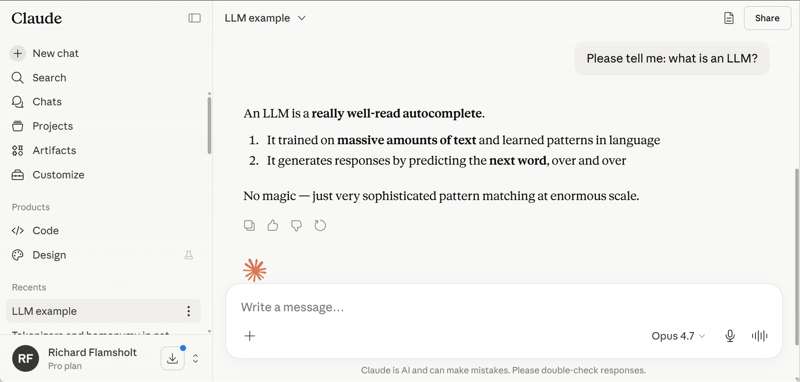
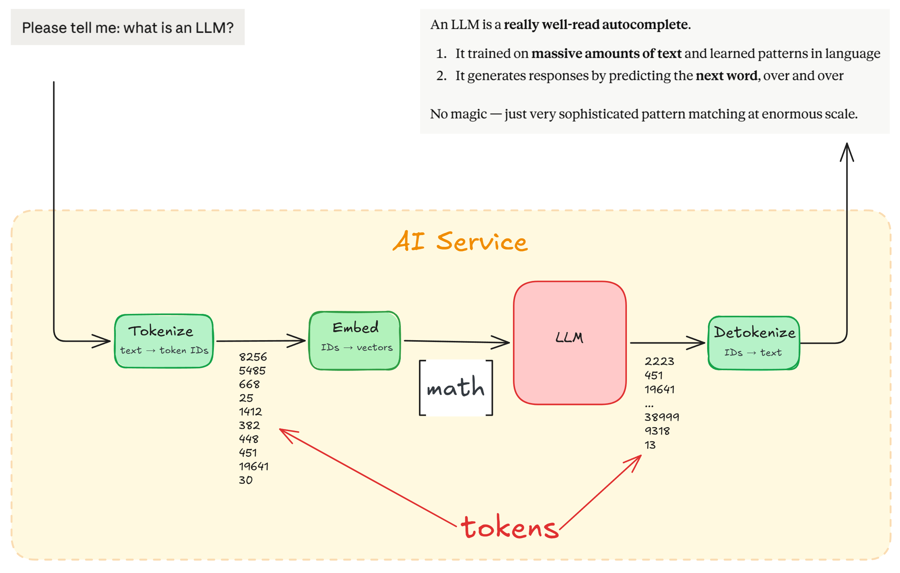
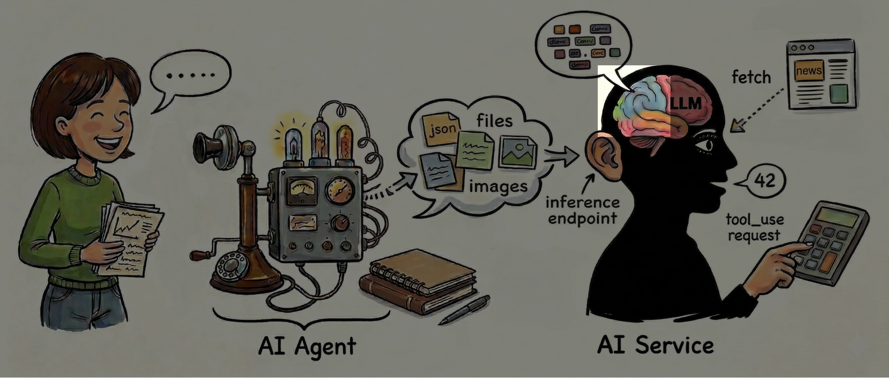
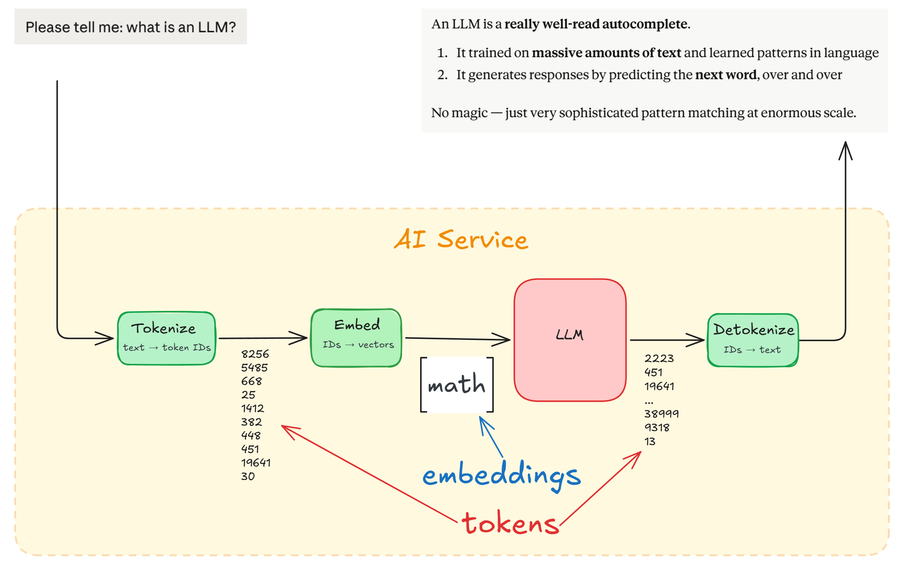
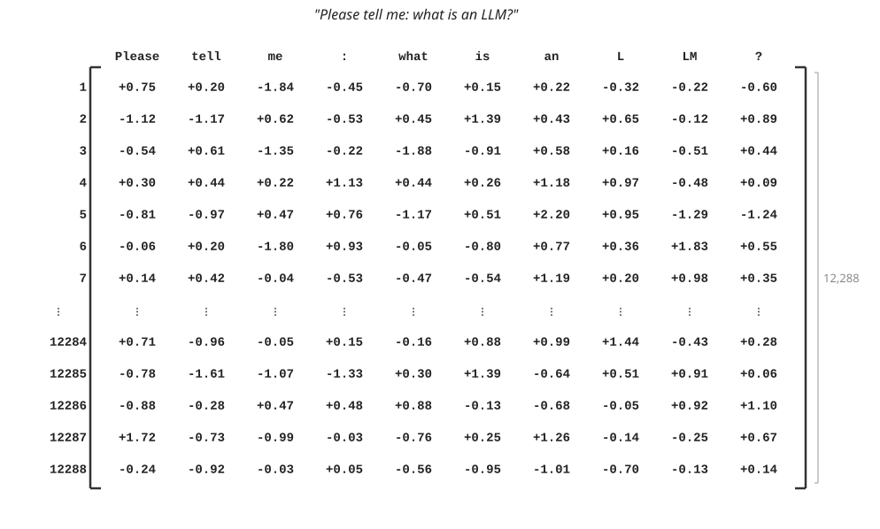
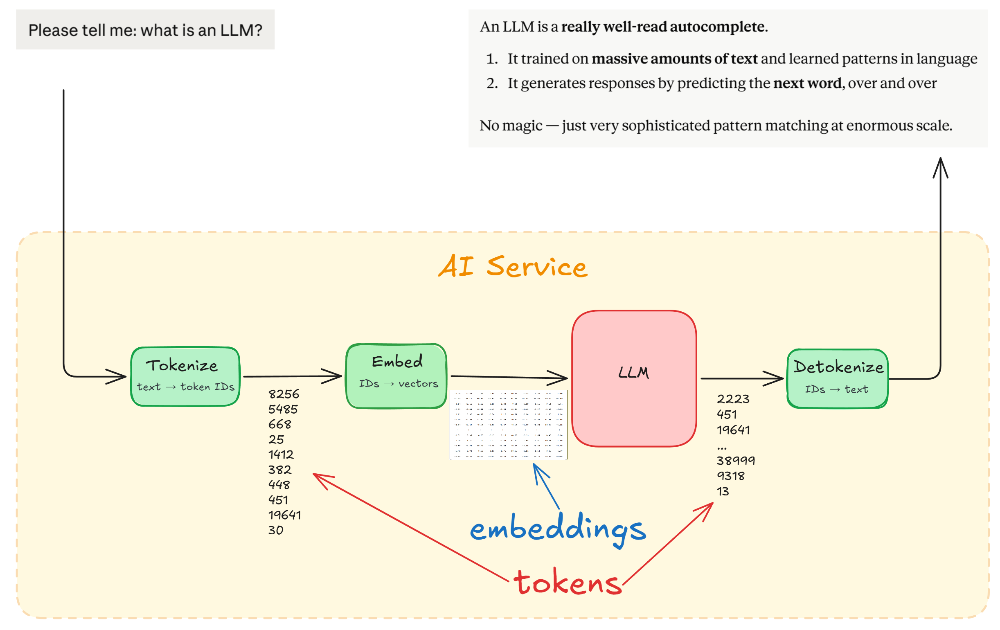
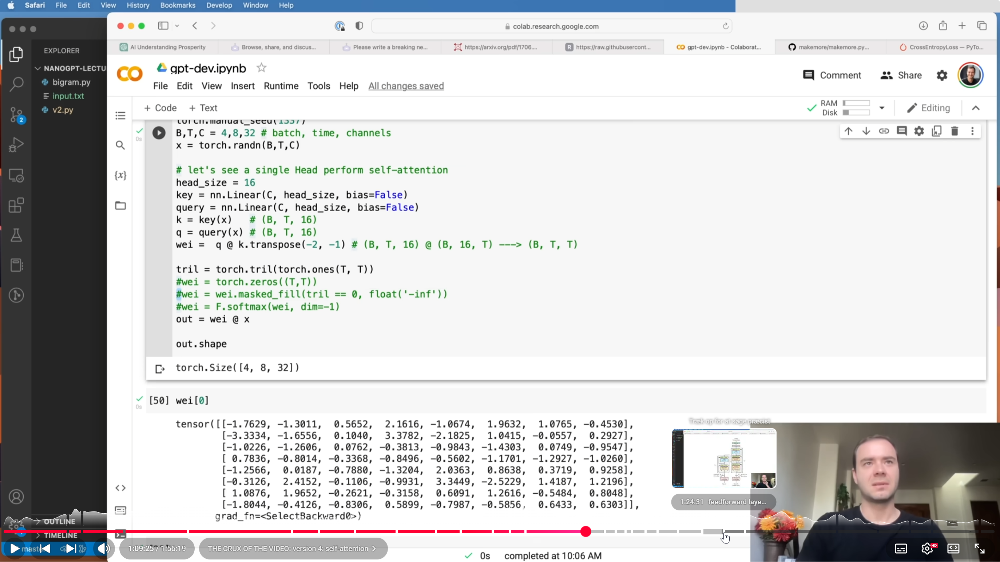
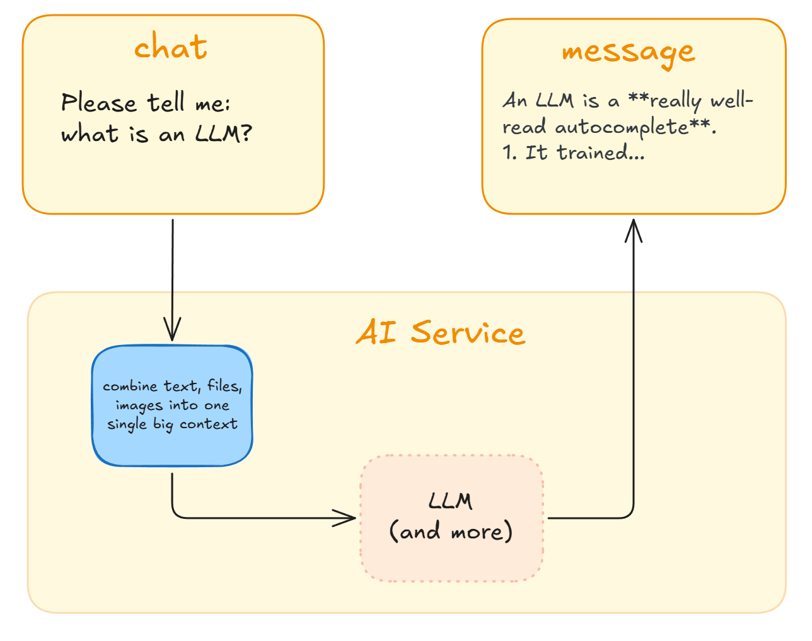

# AI Demystified

## or  "A eye opening insight"

Richard Flamsholt · 2026

#### 
What do I want to tell:
Token, Embedding, LLM, Context, AI-model, Agent, (Prompt), Modes, Thinking, Agent-files, Skills, Tools, MCP - and more.
So you become more confident with the terms, know why AI-models are different, and what the Agents can do and how to drive it.

I hope you'll latch onto something and refer back to the slides and me if you've got questions.

## 10,000,001 AI videos... +1

#### Why this presentation?

What can I possibly say that hasn't already been said in the 10,000,000 existing AI-related videos?
Why is one more presentation about LLMs useful?

I guess for the same reason that you ask an AI about any topic instead of reading some of the 10,000,000 webpages about that topic: you get a personal, curated presentation that tells the story in a way I find insightful - hopefully presenting **just the good bits** from those 10,000,000 videos. Also, you can ask any questions you have.

## All the parts

The **human** use an **AI Agent** to communicate with an **AI Service**, that turn your message into **tokens** and feed it through an **LLM**. The service and agent can use **tools** and the agent also has **memory**.

# The AI Service

## AI Data center

####
The commercial **AI Services** run in massive data centers.

### Frontier AI Foundation Models (FM)

 **Claude** by Anthropic

 **ChatGPT** by OpenAI

 **Gemini** by Google

 **Grok** by xAI *(Elon Musk)*

 **Llama** by Meta *(Facebook)*

 **DeepSeek** by DeepSeek *(Chinese)*

 **Vibe** by Mistral AI *(French)*

 

 Copilot by Microsoft is *not a model*

### Let's ask the LLM

### Let's ask the LLM

## Tokens

### A token is

* Practically, for you: it's **a word**
 
* More precisely: it is the **chunks** the AI break your text into
 
* What you ultimately **pay for** - it's the **unit of work** for the LLM

### "hello" is token 24912 (in gpt-4o)

### ChatGPT 3.5's token vocabulary

####
* [ChatGPT’s entire vocabulary](https://emaggiori.com/chatgpt-all-tokens/)

### "hello" is token 24912

####
Tokenizers:

* [Tiktokenizer](https://tiktokenizer.vercel.app/)
* [OpenAI's tokenizer](https://platform.openai.com/tokenizer)

### "hello world"

### "hello" in the vocabulary

####
Notice that "hello" in the gpt-4o tokenizer is #24912 and in the ChatGPT vocabulary it's 15339. Vocabularies change from model to model. The concrete numbers doesn't matter outside of the AI service so you shouldn't rely on them.

### "h e l l o   w o r l d"

####
This shows one advantage of the tokenization: simply fewer tokens than if everything was spelled out.

### "hello world from me"

####
The first four words are common and have each their own token, but "Flamsholt" isn't worthy of getting its own token so it's made up of 3 parts.

### Token for "Flam"

####
Look' there's "Flam", in dubious company of inflammatory tokens.

### Tokenizing identifies "traits"

####
Another advantage of tokenization is that it allow identifying common linguistic "traits", such as "ization" which is about "doing/producing something". Works for other languages too.

### A danish elevator in motion

####
Another advantage of tokenization is that it allow identifying common linguistic "traits", such as "ization" which is about "doing/producing something". Works for other languages too.

### I fart poetry

####
Another advantage of tokenization is that it allow identifying common linguistic "traits", such as "ization" which is about "doing/producing something". Works for other languages too.

### The English advantage

####
Examples in English, Danish, Korean, Classical Chinese, and C#.

### Revisit the example

### Tokens, summarized

* A **token** is the **chunk of text** the AI service can reason about
* Models typically have a **vocabulary** of 200,000 tokens
* For English, 1 token is roughly 1 word
 
And last, but not least:
 
* AI services **charges per token**, since tokens are the unit the LLM works on
* A ballpark figure: you pay **$1 for 100,000 tokens**
* 100,000 tokens amounts to _"Harry Potter and the Philosopher's Stone"_

####
For English, one token generally corresponds to about 4 characters. For a text the number of tokens will typically be 30% higher than the number of words, ie 1000 words means 1300 tokens - broadly speaking.

## Embeddings

### One more basic part: embeddings

### ⚠️ Warning ⚠️ 

This will sound confusing

Stay with me.

Computers don't understand the word "cat." They understand numbers. So we need a way to turn "cat" into numbers in a way that preserves its meaning. That's what an embedding does.

### An "embedding" is a thing, not an action

#### Notes
In everyday English, "embedding" sounds like something you do: the act of placing something into something else.

In AI, it means the concrete vector of numbers that _somehow_ represent the characteristics of something. It's a noun, not a verb. It's a "thing", not something that "happens".

### The Big Five test (OCEAN)

### Specialty Coffee Association (SCA)

### Spotify's 80-dimensional characteristics

### The meaning of ... "anything"?

### Yes, the meaning of "anything"

### Embedding: a meaning's characteristics

	

An embedding is **list of numbers** (aka a *vector* or *tensor*) that _somehow_ characterises _something_, which can be **anything imaginable!**

_"Somehow"_, because we don't know what "features/traits/aspects" the dimensions corresponds to. We can't say where the "heavy" dimension is and the numbers themselves also only make sense to the LLM.

The **dimension** is simply how many characteristics we have decided to describe it with. The example describes "kitten" by 20 characteristics, i.e. the embedding of "kitten" has 20 dimensions.

Embeddings can be: Any **word** you know. Any **sentence** there exist. Any **feeling** you can have.

Any **concept**, including e.g. **a curious yet mildly confused audience**.

####

Also called _tensor_ in python, or _hidden state_ when speaking about the LLM.

### More of "anything imaginable"

* The concept of the number 7
* Loneliness in a crowded place
* The entire first _Harry Potter_ book
* A single chess position mid-game
* The smell of rain on hot asphalt
* A user's purchases on a website
* A protein's amino acid sequence

* The grammatical role "indirect object"
* The concept of sarcasm _(yeah, right)_
* What "London-ness" feels like
* A function's behavior in a codebase
* A legal precedent in criminal law
* The notion of "almost, but not quite"
* What 3 a.m. feels like

### There could be embeddings for all words

####
Conceptually, every word has an embedding that captures its meaning. This is not entirely correct because we are of course always dealing with tokens, not words - so the vocabulary of an LLM has embeddings for every token instead of words.

### In reality, an embedding for every token

ChatGPT 3 has 50,257 tokens, each described by 12,288 dimensions

## The embeddings, where do they come from?

We'll get to that later

### "Please tell me: what is an LLM?"

####
Also sometimes called as "features", as each value in the vector encodes some learned semantic trait of the token. Like eg "catness" or "largeness".

In practice though we simply don't know what those dimensions mean. They don't map crisply to existing human concepts. Dimension 847 might contribute a little to formality, a little to temporal reference, a little to something related to food, and a lot to some abstract statistical regularity that doesn't map to any word in English.

There's a research field called mechanistic interpretability that tries to decompose these representations into interpretable directions. They can extract interpretable features, but understanding how features compose to produce behavior is still largely unsolved.

* [Scaling Monosemanticity and Feature Steering](https://learnmechinterp.com/topics/scaling-monosemanticity/)
* [Emotion concepts and their function in a large language model](https://www.anthropic.com/research/emotion-concepts-function)
* [How might LLMs store facts | Deep Learning Chapter 7 (3Blue1Brown)](https://www.youtube.com/watch?v=9-Jl0dxWQs8)

### The LLM is all about embeddings

## LLM

### Recap our example

####

Two things to note here:

Why only `An`? Why not the full answer? Yeah, hold your horses just a bit longer, because: the LLM only deals with producing one next token. That's all it is concerned about: figuring out with which *probablility* any of the tokens is the vocabulary has for being the next token.

That's the second thing to note: the LLM itself actually just produce this set of probabilities. The mechanism that actually *picks that next token* is strictly speaking outside the LLM. Let's include it here to convey that the outcome eventually is a token, namely `An` in this case.

### The LLM

Can grasp these embeddings to calculate _"what most likely comes next?"_ by running them through a giant **neural network** composed of billions of calculations.

It's all about **math**.

But surprisingly: on a *large scale*, you can **do math on language**.

####
[Large Language Models explained briefly - 3Blue1Brown](https://www.youtube.com/watch?v=LPZh9BOjkQs)

---

### A neural network

### "The capitol of France is ..."

### The objective: find the next token

####
The very observant reader may spot something unexpected. I claimed that each token's embedding was a fixed vector. But why do the two instances of "you" then not have the same embedding-values?

That's because the transformer initially instill some positional information (1, 2, 3, ...) into each individual embedding, typically using *RoPE* (Rotary Position Embeddings) which "rotates" the vector in 2D spaces in each layer.

Surprisingly, changing the vector values does not remove any of the embedding's "meaning" in the high-dimensional space. It retains its core conceptual meaning, only nudged a little bit.

### Likely next tokens after "you"

"That which does not kill you only makes you _can_" - hmmm

### Enter: The Transformer, in 2017

### "Attention is all you need"

####
The 2017 paper "Attention Is All You Need" by Vaswani et al. is arguably the most consequential piece of computer science research published in the 21st century.

Today, the paper sits at over 200,000 citations, making it an absolute statistical anomaly in scientific literature.

It is the Genesis block of modern AI. Without it, there is no GPT-4, no Gemini, no Claude, no Stable Diffusion, and no AlphaFold. It transformed AI from an academic field of hyper-specialized, rigid pipelines into a unified era of generalized foundation models.

[Attention Is All You Need](https://proceedings.neurips.cc/paper_files/paper/2017/file/3f5ee243547dee91fbd053c1c4a845aa-Paper.pdf)

### The Transformer can figure this out:

### Let's begin - here's the input again

### First, all embeddings "pay attention"

####

### A neural network let training kick in

####

### Focus on the strong signals

####

### Now do this again...

####

### Search for next token after "you"

####

### In fact, let's do it 96 times

####

### 175 billion small "weights"

### Final absorbed status

####

### Find next token by similarity

Also known as "cosine similarity"

####

The cosine similarity of 0.97 is computed in isolation — it's purely a geometric measurement between two vectors, with no knowledge of the other 127,999 tokens. The 91% is a different kind of number entirely: it's the result of a competition. Softmax takes all 128,000 similarity scores simultaneously, exponentiates each one, and divides by their sum. Every token competes against every other token at once. "Stronger" claimed 91% of the total probability mass — not because 0.97 is intrinsically high, but because it pulled far enough ahead of the field. A high cosine similarity is the evidence. The probability is the verdict.

### Choose the final output token

####

### Our example has now produced "An"

### Repeat until the LLM says stop

####
### 58 transformer-roundtrips for 58 tokens

### Tokens are generated one by one

Yes, it's actually true: the LLM really is a "very well-read _autocomplete_"

####
This is what really boggles my mind. Each token is generated completely independently, only by choosing the most likely next word to come after what has already been seen now. There is no planning.

There's no plan to "bold" a word by emitting `** something **`. Instead at one point an ` **` is emitted and later on another `**` is emitted.

There's no planning of emitting an itemized list. At one point a `1` is emitted and then a `.` and that cause the likelyhood pattern-wise of a later `2` and `.` to occur to rise significantly. But it happens independently without any overall grand design or planning.

## Cost

### Harry Potter ~ 100,000 tokens

####
Because the AI has access to the full text of book 1 in its active memory, but its underlying weights are deeply biased toward the real book 2, the resulting "original" stories are incredibly bizarre hybrids. The AI will invent a plot where Harry returns to Hogwarts, but it will subconsciously map the beats of Chamber of Secrets anyway—often renaming the Basilisk to something else but keeping the exact structural cadence of the original sequel.

### 100,000 tokens in, one token out
 

### It's one token, how much could it need?
 

### 1,200,000,000,000 multiplications
 

**FLOPS** means Floating-Point Operations, i.e. multiplication

### Enter the NVidia B200 GPU

Not your Gaming Grandma's GeForce graphics card

 

### 4,500,000,000,000,000 FLOPS/sec

### xcvx

 

&nbsp;&nbsp;&nbsp;&nbsp;&nbsp;&nbsp;&nbsp;1,200,000,000,000 FLOPS to produce **1 token**

4,500,000,000,000,000 FLOPS/sec is B200 capacity
 
The output of one 4 x B200 cluster serving a Claude Opus tier model depends on the length of the context:
 
* 4,000 token context: 50 users at 60 tokens/sec
* 100,000 token context: 10 users at 40 tokens/sec
* 1,000,000 token context: 1 user at 15 token/sec

### Cost per output token

 

Price of 4x B200 cluster: $500,000

* Ballpark cost, all-included: ~$27/MToken
* Claude Opus is priced at **$25/MToken** (June 2026)
&nbsp;

 

### The 4x B200 cluster
 

### Clusters goes into trays
 

### Trays goes into racks
 

### Racks goes into aisles
 

### Now you have a datacenter
 

### Why Graphics Cards (GPU)?

### Transformer's superpower: all at once

### GPU: master of parallel computations

### NVidia stock price
 

### 🇳🇱 All chips produced by ASML, btw 🇳🇱

####
[The World's Most Important Machine - Veritasium](https://www.youtube.com/watch?v=MiUHjLxm3V0)

## Training

### What makes ChatGPT act as it does?

TODO: examples

### How models are trained

####

* Base training - the "auto-complete" _facts_
* Alignment learning - the _values_
* Fine-tuning / RAG - the _specialization_

Pretraining is where the model learns language itself. Fed vast amounts of text, it learns to predict the next token — nothing more. The result is a powerful but raw capability: it knows how language works, how facts relate, how arguments are structured. It has no personality, no values, no sense of what a "good" response looks like.

Supervised Fine-Tuning (SFT) and Reinforcement Learning is where the model learns what good means to its creators. Humans or AI (RLHF or RLAIF) evaluators compare outputs and rank them. The model is iteratively shaped toward preferred behavior — this is where values, tone, refusal behaviors, and personality get baked in.

### Read all sentences in the world

####
Putting the **Large** in the *"Large Language Model (LLM)"*

### Training: how the embeddings are born

	

**Backpropagation**:

1. Run tokens through the transformer (as before)
2. Reward weights leading to the expected token
3. Will adjusts "all" weights
4. Trains sub-strings, too
5. Train on a gazillion texts

### Backpropagation ...ok, let's move on...

### Pre-trained models are quite similar

### Post-training shapes the model

**Different personalities:**

ChatGPT – Structured explainer

Gemini – Diligent researcher

Claude – Honest advisor

Grok – Radical truth-seeker

Meta AI – Pragma over polish

Mistral – Efficient European

DeepSeek –  Censored thinker

### Post-training: strenghten preferred answers

### Reinforcement Learning by Feedback

**RLHF** - Reinforcement Learning from *Human Feedback* (declining)
**RLAIF** - Reinforcement Learning from *AI Feedback* (growing)
 

####

Frontier labs almost universally outsource the bulk of RLHF annotation rather than hiring raters directly. The main intermediaries:

* Scale AI / Outlier — the dominant player, operating as an end-to-end data engine. Outlier handles LLM annotation, Remotasks handles visual/multimodal work. Scale is OpenAI's preferred fine-tuning partner and has also worked with Meta, Google DeepMind, and others. Taskmonk AI
* Surge AI — Anthropic's primary RLHF provider, with ~50,000 expert contractors. Also used by OpenAI and Meta. Taskmonk AI
* Invisible — shifted from executive VA services to RLHF work for labs including Microsoft, Cohere, and Mistral. Routes model outputs through trained raters who score completions and rank outputs. Sacra

Outlier alone runs a network of 700,000+ contractors globally. The work is heavily gig-economy in structure.

Pay ranges from $15/hr for generalist annotators up to $500+/hr for domain experts like medical fellows and legal professionals. Invisible charges labs $30–45/hr for annotation work while paying raters $15–20/hr.

Each major frontier AI lab spends approximately $1 billion per year on human-generated training data, according to a 2025 Time Magazine investigation.

### Example: Claude's Constitution

####
[Claude’s Constitution - Anthropic](https://www.anthropic.com/constitution)
[OpenAI Model Spec](https://model-spec.openai.com/2025-12-18.html)

### Describes Claude’s values and behavior

### "New model is 4x ..."

####
[Model system cards](https://www.anthropic.com/system-cards) - System cards document the capabilities, safety evaluations, and responsible deployment decisions for Claude models.

### ChatGPT - rules over principles

### ChatGPT spec example

### Gemini et al - no public training guidelines

### So, are models different? Yes.

* Anthropic wants Claude to *reason from principles* — no rulebook needed
* OpenAI wants ChatGPT to *follow their spec* — rules written down explicitly
* Google wants Gemini to *behave correctly* — but via unpublished rules
* Meta wants Llama *powerful and open* — open weights, few restrictions
* Mistral wants Vibe *capable, open, and European* —  compliant, not principled
* DeepSeek wants its models *helpful and harmless* — as defined by the state
* xAI wants Grok to *tell the truth* — no censorship, no moralizing, no wokeness

### Model variations

####
For example, the Claude family are physically three different models: different size, training, speed, cost, strengths.

### Training cost

* From scratch, a new AI model:
  * Estimated training **cost is $200M to $1B**
  * Estimated training **time is 6 months**
 
* From existing model, eg Claude Opus 4.7 to 4.8:
  * Estimated training cost is max 10% of full training
  * Estimated training time is maybe a month

### Gemini - 

### Nerd movie night: Karpathy builds a GPT

Only 600 lines of Python code: 300 for `train.py`, 300 for `model.py`

####
2 hours of Andrej Karpathy building a small GPT model, fully.

[Let's build GPT from scratch (2 hours)](https://www.youtube.com/watch?v=kCc8FmEb1nY)
[Let's reproduce GPT-2 (4 hours)](https://www.youtube.com/watch?v=l8pRSuU81PU)
[Github repo for nanoGPT](https://github.com/karpathy/nanoGPT)

## The AI Service

### What can it do?

_Surprisingly, only a few things:_

1. Read the chat and produce a response
2. Understand documents and images (+video/audio?)
3. Think harder
4. Call tools
 
5. A few other things; caching, safeguarding
6. And quite notably: *it has no memory*

### But but but - what about...?

Call internal tools; run python, produce images
Call external tools via MCP servers
Ask the caller to use tools or MCP servers

* all those agents.md files you hear about?
* skills
* setting the language
* modes - plan, autopilot, and so on?
* conversation tone?

### Overview

### The full monty

####
Your diagram is the undisputed Common Core of the modern LLM runtime. For standard open-weight architectures (like Meta's Llama series or Mistral) and classic chat endpoints, this blueprint captures the system flawlessly.

Your diagram captures the Canonical Engine Blueprint. It cleanly outlines the immutable data flow, boundary gates, and structural contracts of modern AI. Leaving the vendor-specific bells and whistles off the page isn't an omission—it's good engineering discipline.

### Token spree

<iframe class="game"
  src="https://ricflams.github.io/techtalk-ai-demystified/tokenspree/"
  allowfullscreen>
</iframe>

*[▶ Open interactive version](https://ricflams.github.io/techtalk-ai-demystified/tokenspree/)*

# The AI Agent

What is an AI Agent?

## Choosing of AI Service and LLM-model

## Choosing an AI Agent

# How to drive your AI Agent

## Level 0: Use the basic controls: modes (plan, agent), thinking, individual chats

## Level 1: give it specific general instructions

## Level 2: give it task-specific instructions: in web, use projects or gems etc; on CLI use agent.md files

## Level 3a: Skills

Skills look like a smart routing system — describe what a skill does, and Claude figures out when to use it. But the routing isn't magic, and it isn't symmetric.
There's an instruction baked into Claude Code's system prompt that says roughly: before writing code or creating files, check whether any skills are relevant. That instruction is what makes skills feel reliable for those task types. It's a forcing function — the model is explicitly told to look before it acts.
For everything else — answering questions, explaining concepts, responding to anything conversational — there's no forcing function. The model might still invoke a skill if your description matches strongly enough, but it's relying on the description alone to catch its attention during the forward pass. That's a much weaker signal.
The practical consequence: if you write a skill for a task type that isn't file creation or code writing — say, a skill for how your team handles incident postmortems, or tone guidelines for executive communication — and you wonder why it's not triggering reliably, this is why.
The fix is simple: add an explicit instruction to your CLAUDE.md that names the trigger condition and the file path. "Before responding to any question about incidents, first read this skill." That gives you the same forcing function the built-in instruction provides, but for your task type.
Skills aren't self-activating. The description is a hint, not a contract. If you need guaranteed activation, you need an explicit instruction.
## Level 3b: Tools

## Level 3c: MCP

my mcp poc example

## Level 4: Go crazy with subagents, agent-specific commands, openclaw, etc

## Level 5: Go beyond the Agent: speak directly AI API, setup RAG vector database, control temperature and sys prompt, etc

# How to brake the AI Agent
....

# Fact or Fiction?

"Lost in the middle was real in 2023, is largely solved for simple retrieval in 2026, persists for complex tasks — and the reason it ever existed is still being worked out. so my suggestion is: stop worrying about the middle, and start worrying about the load. "Keep your facts close and your context lean."

# Embeddings, revisited

# How I use AI now

# Summary

---

---

---

---

---

