

# AI Demystified
Richard Flamsholt

August 2026

---

####
Over time, some landmark tech has particularly triggered my brain.

Back when HTML and XML came out I was like, man, I just want to know all about it.

Same with Java and .NET, with their intriguing bytecode and VM-engines.

For the past year I've felt that way about AI. And I think we're all filled with emotions about AI. It's so exciting and promising, but also mysterious. There's this feeling that "it can do anything if I only hold it right". that can lead to FOMO, fear of holding it wrong, disappointment in the AI or yourself if it doesn't work as well as imagined.

---

####
Many lightbulb-moments have given me a better fundamental understanding of AI and how to best use it. The context, cost, limitations. It has *demystified* the AI and I wish for other to have that insight too.

---

####
Let's begin far removed from any AI: a nice freshly baked bread.

You can bake lovely, soft, crunchy bread without knowing what "yeast" actually is or what it does. "Add yeast, then set the clock to let the dough rise for one hour", as the recipe says. The bread comes out fine. Usually.

---

####
But how *does* yeast cause the dough to "rise"? And should it be placed somewhere warm? But not too warm?

---

####
Some even say "put the dough in the fridge". It can seem a bit mysterious.

---

####
Now, if you know that yeast is a living organism that cause fermentation by using enzymes to feed on sugar in the flour, then the whole thing can become quite demystifed. Still complex, sure, but you can now understand how the choice of flour, additives, and temperature over time affect the dough. And understand how you can make deliberate choices to "steer" the dough better.

For example a "cold ferment": let the yeast work normally for an hour and then place the dough in the fridge to put the yeast to sleep while the enzymes continue to work on building flavor and gluten. A lot of advanced baking processes can seem arbitrary or magical ("add diastatic malt powder to ...") but armed with a fundamental understanding of the way yeast and enzymes works you're much better equipped to understand them - and steer them your own way, too.

---

####
This presentation is about the yeast and enzymes of AI. And frankly, it's about *all of the AI*.

---

####
Let me say this up front: will that knowledge turn you into an expert baker overnight? Maybe not. But it will help you reason about the underlying mecahnisms, the fundamental behavior and limitations of the AI. Personally I have found that really, really useful.

---

####
It's my hope and goal that this presentation will help you rise (haha) to become much more confident in your use of AI.

# "Just the basics"

---

####
This may well has been the most challenging presentation I've ever put together.

Because it's not some fringe topic, like for example Quantum Computing, where I can shine or dazzle you and you frankly wouldn't have much use of it anyway. On the contrary: everybody is interested in AI and everybody's using AI and I should most certainly strive to give insights that is truly useful. That, I decided, would be the fundamentals: the LLM and AI-service itself, the core understanding that is still relevant in a year. Just those parts. Just keep it simple, I thought.

---

####
"Simple", yeah right. Each little bit is a rabbit hole worthy of an entire presentation.

---

####
This is the path we'll take:

We'll start with the technical parts. How does the AI work? What can it do? In particular explore the LLM deeply because it is the most fundamental part of all. That will be the hardest part - just saying.

With that in place we'll see *how to use* the AI. How to tame the context. A look at guidance and myths.. At the end there's a surprise.

### 10,000,000 videos + 1

####
Why am I telling you this? What can I possibly say that hasn't already been said in the 10,000,000 existing AI-related videos? Why not just give you 10 links to the most popular videos about LLMs?

In my opinion for same reason that you ask an AI about any topic instead of reading some of the 10,000,000 webpages about that topic: you get a personal, curated presentation that tells the story in a way I find insightful - hopefully presenting **just the good bits** from those 10,000,000 videos. Also, you can ask any questions you have.

---

####
About that: if you're thinking "hang on, that can't be right" or "I don't get it!" then feel free to raise your hand and ask questions.

Afterwards go revisit the slides at your own pace. They are on github and has lots of links to related materials.

And ask me or other colleagues if you've got questions. I'd be happy to elaborate on *everything* I'm presenting here today.

---

####
Final words: I've strived to make the presentation deep and useful but also entertaining and surprising. Be prepared to stay alert, because there's a lot to cover in only one hour so we'll move really fast.

---

You, the **human**, use an **AI Agent** to communicate with an **AI Service** that turn your messages into **tokens** and feed it through an **LLM**. The service and agent can use **tools** and the client can **remember**.

####
This is what we'll cover.

I've already said "the AI" many times. Let's be clear: in this presentation I am talking about AI that generates text, like Claude, ChatGPT, Gemini, Grok, etc. They all use an LLM, a Large Language Model AI, and their principles and capabilities are very similar, broadly speaking.

So AI here means generative text AI. Not AI for generating images using stable diffusion, not AI for self-driving cars, not AI for folding proteins.

[Understand AI in 14 minutes – with Anthropic's Chloe Lubinski [ARC 2026]](https://www.youtube.com/watch?v=aBUniZHgCnE)

# The LLM

**Large Language Model**

---

### The LLM is the brain

####
The LLM is the only part that thinks.

### "Please tell me: what is an LLM?"

### The LLM only does math on numbers

## Tokens and embeddings

## Tokens

### Tokens goes in, tokens comes out

### A token is

* A token is practically **a word**, like "hello"
 
* It is the **chunk of text** the LLM works on
 
* Therefore what you ultimately **pay for**
 

### In gpt-4o, "hello" is token number 24912

####
AI models have specific token vocabularies.

### ChatGPT 3.5's token vocabulary

####
* [ChatGPT’s entire vocabulary](https://emaggiori.com/chatgpt-all-tokens/)
https://emaggiori.com/chatgpt-vocabulary/

### "hello"

####
Tokenizers:

* [Tiktokenizer](https://tiktokenizer.vercel.app/)
* [OpenAI's tokenizer](https://platform.openai.com/tokenizer)

### "hello world"

### "hello" in the vocabulary
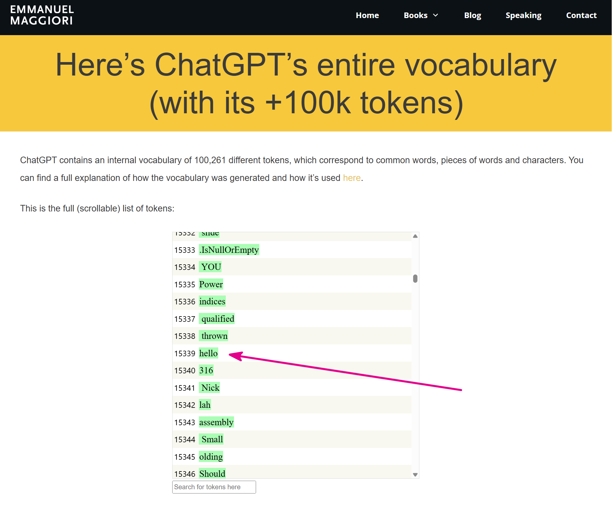

####
Notice that "hello" in the gpt-4o tokenizer is #24912 and in the ChatGPT vocabulary it's 15339. Vocabularies change from model to model. The concrete numbers doesn't matter outside of the AI service so you shouldn't rely on them.

### "h e l l o   w o r l d"
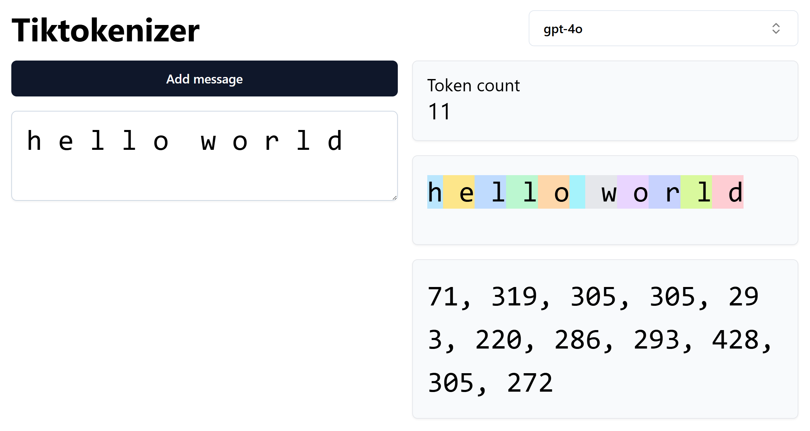

####
This shows one advantage of the tokenization: simply fewer tokens than if everything was spelled out.

### "hello world from ..."

####
The first four words are common and have each their own token, but much to my disappointment it seems "Flamsholt" isn't worthy of getting its own token so it's made up of 3 parts.

### Token for "Flam" is 97957

####
Look' there's "Flam", in dubious company of inflammatory tokens.

### Save space and identifies "word-features"
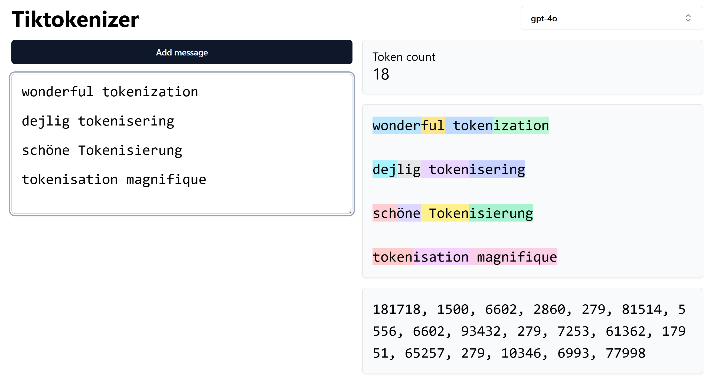

####
Another advantage of tokenization is that it allow identifying common linguistic "traits", such as "ization" which is about "doing/producing something". Works for other languages too.

### A danish elevator "in motion"

####
Another advantage of tokenization is that it allow identifying common linguistic "traits", such as "ization" which is about "doing/producing something". Works for other languages too.

### I fart poetry

####
Another advantage of tokenization is that it allow identifying common linguistic "traits", such as "ization" which is about "doing/producing something". Works for other languages too.

### Same text, same token - always
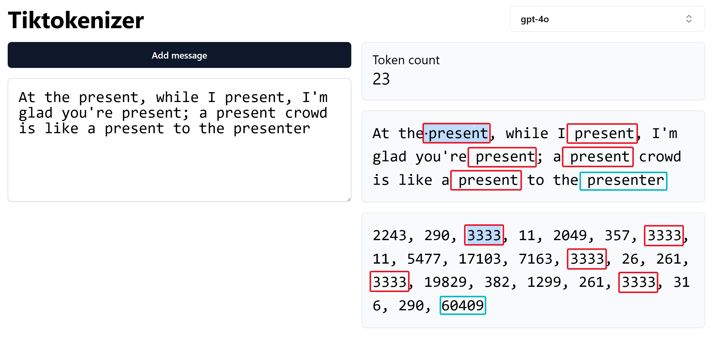

####
Examples in English, Danish, Korean, Classical Chinese, and C#.

### English dominates, by sheer volume

####
Examples in English, Danish, Korean, Classical Chinese, and C#.

### TODO: 

Fun category — Danish/English false friends. Here are 10 good ones:

Gift — dansk: gift (married) eller gift (poison); engelsk: en gave
Barn — dansk: et barn (child); engelsk: en lade
Sky — dansk: en sky (cloud, eller sovs-sky); engelsk: himlen
Slut — dansk: slut (the end); engelsk: … noget helt andet
Kind — dansk: en kind (cheek); engelsk: venlig
Tag — dansk: et tag (roof); engelsk: et mærke/en etiket
Dog — dansk: dog (however); engelsk: en hund
Gal — dansk: gal (crazy); engelsk: slang for en pige
Bog — dansk: en bog (book); engelsk: en mose
Stole — dansk: stole (chairs, eller at stole på); engelsk: datid af "steal"

Bonus: and (duck), men (but), og sand — som på dansk både betyder sand og true, så den er en dobbelt false friend.

### Revisit the example

### Tokens, summarized

* A **token** is the *chunk of text* the LLM reason about
* Models typically have a **vocabulary** of 200,000 tokens
* For English, 1 token is roughly 1 word (3/4 of a word)
* Tokens are not language specific, just snippets of text
 
Last, but not least:
 
* Ultimately, *cost* is directly related to number of tokens

####
For English, one token generally corresponds to about 4 characters. For a text the number of tokens will typically be 30% higher than the number of words, ie 1000 words means 1300 tokens - broadly speaking.

## Embeddings

### An embedding embodies the meaning (characteristica, features, traits, ...) of something, anything

####
In everyday English "embedding" sounds like something you do: the act of placing something into something else.

In AI, it means a concrete vector of numbers that _somehow_ represent the characteristics of something. It's a noun, not a verb. It's a "thing", not something that "happens".

### Stay with me
TODO: maybe another or no image

####
You probably knew about tokens. Embeddings are the "live" counterpart to tokens, and they are incredibly valuable to grasp the meaning of. It may feel abstract and complex so sit tight.

### Specialty Coffee Association (SCA)

### Spotify's 80-dimensional characteristics

####
Spotify really does characterize music using 80 dimensions.

### Imagine capturing the essense of ... anything

### An embedding is a token's characteristics

	

An **embedding** is a list of numbers (also called a **vector** or **tensor**) that _somehow_ characterises _something_. Sometimes called "features", as each value in the vector encodes some semantic trait of the token.

The number of nuances, characteristics, we decide to use is called the embedding's **dimension**. If we choose 20 characteristics then the embedding of "kitten" has 20 dimensions.

Each number is called the **weight** of that dimension.

Embeddings can be: Any *word* you know. Any *sentence* there exist. Any *feeling* you can have. Any *concept*, including e.g. *a curious yet mildly confused audience*.

### More of "anything imaginable"

* The concept of the number 7
* Loneliness in a crowded place
* The entire first _Harry Potter_ book
* A single chess position mid-game
* The smell of rain on hot asphalt
* A user's purchases on a website
* A protein's amino acid sequence

* The grammatical role "indirect object"
* The concept of sarcasm _(yeah, right)_
* What "London-ness" feels like
* A function's behavior in a codebase
* A legal precedent in criminal law
* The notion of "almost, but not quite"
* What 3 a.m. feels like

### Every token has an embedding-vector

ChatGPT 3 has *50257 tokens*, each described by a *12288-dimensional* embedding

### The example's embeddings

####
Each of these lists of 12288 numbers represent the core meaning of that single token. The meaning of "Please", the meaning of "tell", the meaning of "me", and so on.

So what we have here is a set of numbers that essentially represents the full meaning of the entire context.

The weights are constructed during the LLM's training. Right now just accept that those 12288 numbers do in fact characterise all aspects of one single token. We'll cover how they've come to be later.

### An embedding is a "direction" in a hyper-dimensional space of everything that exists

####
One way to think about an embedding is as a "direction", an "arrow", in a hyper-dimensional space of every conceivable and inconceivable concept. Because that is, in fact, what it is. And it leads to some astounding and surprising behaviors.

####
Also known as the **latent space**.

### Similar "meanings" are similar "directions"

### The big surprise to everybody: We can "do math" on language

---

### Example: Two embeddings, man and woman

### Uncle and aunt

### Nephew and niece

### King and queen

### There's a "gender direction"

####
Since an embedding is a direction in this hyper-dimensional space, this kind of "gender-direction" is of course in itself also an embedding. We have identified the embedding of the concept "the feminine version of something".

### The direction for "sadness"

### The direction for "whimsical"

### The direction for "rainbow"

### The direction for "spatula"

### Germany-Italy
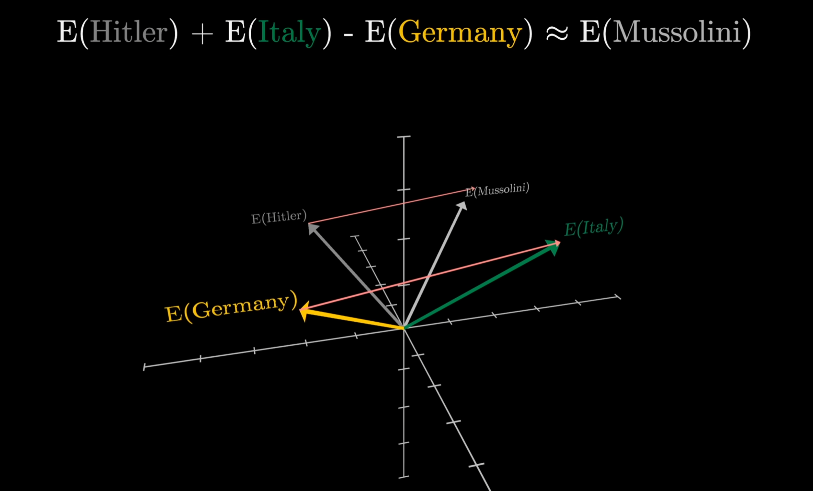

### Germany-Japan

### Takeaway about embeddings

1. You can *compare embeddings* to figure out how similar the meanings they represent are.
For instance, find a *synonym* by simply finding the closest embeddings to a word
 
2. Embeddings are "meanings" and that meaning can be *transformed with math*
 
3. An embedding is *just some numbers*. Cheap to store in a database and work on.
 
4. (Covered later) The embeddings relates to *a concrete model* and are created during the training of that specific model; their numbers only make sense to that model 

### An embedding: any meaning, as numbers

####
To hammer it home: An embedding can be anything imaginable, not just a word. There's surely a 12228-dimensional set of numbers that represent *"the hopeful feeling that the audience grasp a complex issue you explain"*.

Frankly we simply don't know what the dimensions or numbers mean. They don't map crisply to existing human concepts but only makes mathematical sense. Dimension number 7 of "Please" might contribute a little to politeness, a little to interactivity, a little to something related to food, and a little to some abstract concept that doesn't map to any word in English.

There's a research field called mechanistic interpretability that tries to decompose these representations into interpretable directions. They can extract interpretable features, but understanding how features compose to produce behavior is still largely unsolved.

* [Scaling Monosemanticity and Feature Steering](https://learnmechinterp.com/topics/scaling-monosemanticity/)
* [Emotion concepts and their function in a large language model](https://www.anthropic.com/research/emotion-concepts-function)
* [How might LLMs store facts | Deep Learning Chapter 7 (3Blue1Brown)](https://www.youtube.com/watch?v=9-Jl0dxWQs8)

### The LLM does "math on embeddings"

####
It relies on what we just covered: on a *very large scale*, we can *do math on language*.

## The LLM

### Putting the example through the LLM

The **context** is the input given to the LLM - here, 10 tokens
The **context window** is the longest input possible, typically 200,000-1,000,000 tokens
The LLM does **inference** by running the embeddings through a giant **neural network**
 

####
Two things to note here:

Why only `An`? Why not the full answer? Yeah, hold your horses just a bit longer, because: the LLM only deals with producing one next token. That's all it is concerned about: figuring out with which *probablility* any of the tokens is the vocabulary has for being the next token.

That's the second thing to note: the LLM itself actually just produce this set of probabilities. The mechanism that actually *picks that next token* is strictly speaking outside the LLM. Let's include it here to convey that the outcome eventually is a token, namely `An` in this case.

####
[Large Language Models explained briefly - 3Blue1Brown](https://www.youtube.com/watch?v=LPZh9BOjkQs)

### A neural network

####
Software that learns primarily by guessing answers and getting corrected. Trained on human language.

https://tikz.net/neural_networks/
(good images)

### "The capitol of France is ..."

####
After billions of calculations the neural network can predict _"what token likely comes next after this?"_

TODO: Maybe: The neural network example

### The LLM's objective: find likely next token

####
The very observant reader may spot something unexpected. I claimed that each token's embedding was a fixed vector. But why do the two instances of "you" then not have the same embedding-values?

That's because the transformer initially instill some positional information (1, 2, 3, ...) into each individual embedding, typically using *RoPE* (Rotary Position Embeddings) which "rotates" the vector in 2D spaces in each layer.

Surprisingly, changing the vector values does not remove any of the embedding's "meaning" in the high-dimensional space. It retains its core conceptual meaning, only nudged a little bit.

### Probabilities for words following "you"

"That which does not kill you only makes _you can_" - hm, that's not right

### Enter: The Transformer, in 2017

### "Attention is all you need"

####
The 2017 paper "Attention Is All You Need" by Vaswani et al. is arguably the most consequential piece of computer science research published in the 21st century.

Today, the paper sits at over 200,000 citations, making it an absolute statistical anomaly in scientific literature.

It is the Genesis block of modern AI. Without it, there is no GPT-4, no Gemini, no Claude, no Stable Diffusion, and no AlphaFold. It transformed AI from an academic field of hyper-specialized, rigid pipelines into a unified era of generalized foundation models.

[Attention Is All You Need](https://proceedings.neurips.cc/paper_files/paper/2017/file/3f5ee243547dee91fbd053c1c4a845aa-Paper.pdf)

### The Transformer can figure this out:

### Let's begin - here's the input again

### First, all embeddings "pay attention"

####
Every embedding gets influenced by every embedding token before it. They "absorb" the meaning of all those other embedding, influenced also by the position. The first "you" and the second "you" come from the same token, yes, but by virtue of their position they don't carry the same meaning, i.e. they don't start out as the same embedding-values, and they rub against ("pays attention to") the other tokens in different ways.

For a full 1M context-window this means that up all 1 million embeddings pays attention to every other of the 1 million embeddings before it. That's the order of a million times a million calculations.

### A neural network act on it, as trained

####
This is where the model's built-in training shapes the meaning of the embeddings.

### Focus on the strong signals

####
Dial up the contrast, in a way: boost the strong signals and suppress the noise.

### Now do this again...

####

### Slowly molding the meaning of that "you"

####

### Let's do it 96 times (attention layers/heads)

####

### 175 billion small "weights" are involved

### Final embedding: the desired next "meaning"

### Find next token by similarity-comparison

Also known as "cosine similarity"

Score all tokens in the vocabulary (1-200,000 tokens)

####
The cosine similarity of 0.97 is computed in isolation — it's purely a geometric measurement between two vectors, with no knowledge of the other 199,999 tokens. The 91% is a different kind of number entirely: it's the result of a competition. Softmax takes all 2000,000 similarity scores simultaneously, exponentiates each one, and divides by their sum. Every token competes against every other token at once. "Stronger" claimed 91% of the total probability mass — not because 0.97 is intrinsically high, but because it pulled far enough ahead of the field. A high cosine similarity is the evidence. The probability is the verdict.

### Choose the final output token

### Let's go back to our example

### The context will produce token "An"

### For a full sentence: repeat until LLM says stop

### 58 roundtrips for 58 tokens

### Tokens are really generated one by one

That's why output tokens are typically *5 x more expensive* than input tokens.
 

####
This is what really boggles my mind. Each token is generated completely independently, only by choosing the most likely next word to come after what has already been seen now. There is no planning.

There's no plan to "bold" a word by emitting `** something **`. Instead at one point an ` **` is emitted and later on another `**` is emitted.

There's no planning of emitting an itemized list. At one point a `1` is emitted and then a `.` and that cause the likelyhood pattern-wise of a later `2` and `.` to occur to rise significantly. But it happens independently without any overall grand design or planning.

TODO: Not so: j-space.

J-space
https://claude.ai/chat/8b6e9845-edb1-43b0-aeb5-f90d7e9650db

## Cost and effort

### It's one token, what could it cost?

### Harry Potter ~ 100,000 tokens

####
Because the AI has access to the full text of book 1 in its active memory, but its underlying weights are deeply biased toward the real book 2, the resulting "original" stories are incredibly bizarre hybrids. The AI will invent a plot where Harry returns to Hogwarts, but it will subconsciously map the beats of Chamber of Secrets anyway—often renaming the Basilisk to something else but keeping the exact structural cadence of the original sequel.

### 100,000 context tokens in, 1 token out
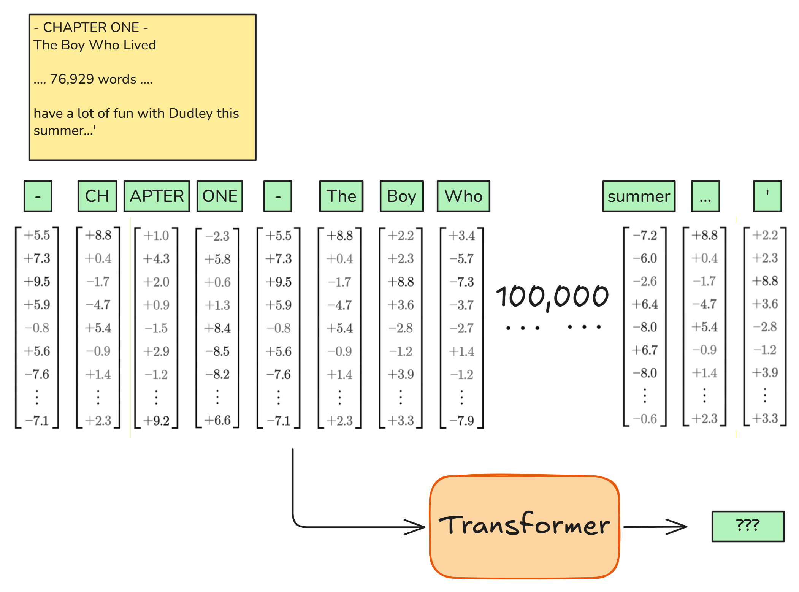 

### How much math does one token out need?
 

### Actually: 1,200,000,000,000 multiplications
 

**FLOP** is short for Floating-Point Operation: a multiplication of two numbers

### Enter the NVidia B200 GPU

Not your Gaming Grandma's GeForce graphics card

 

### 4,500,000,000,000,000 FLOPS/sec

### Pedal to the metal

 

&nbsp;&nbsp;&nbsp;&nbsp;&nbsp;&nbsp;&nbsp;1,200,000,000,000 FLOPS to produce **1 token**

4,500,000,000,000,000 FLOPS/sec is B200 capacity
 
The output of one 4 x B200 cluster serving a Claude Opus tier model depends on the length of the context:
 
* 4,000 token context: 50 users at 60 tokens/sec
* 100,000 token context: 10 users at 40 tokens/sec
* 1,000,000 token context: 1 user at 15 token/sec

### Ballpark cost per output token

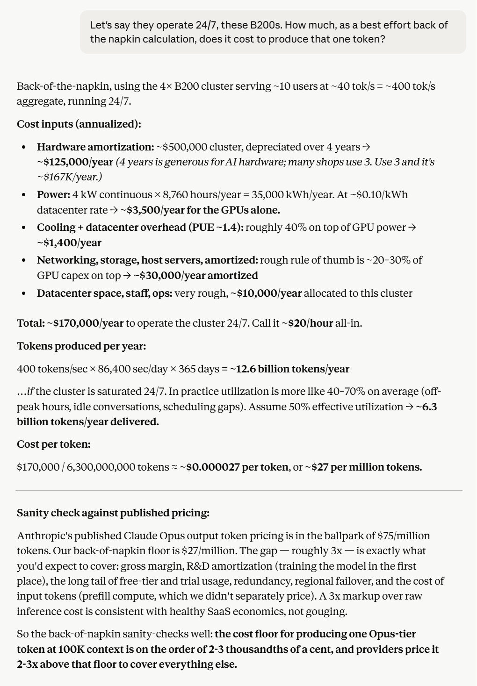 

One 4 x B200 cluster costs $500,000

* Ballpark running cost, all-included: *$27/MToken out*
* Claude Opus is priced at $25/MToken (June 2026)
&nbsp;

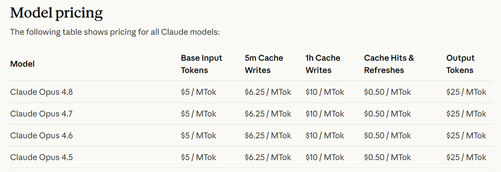 

### The 4 x B200 cluster
 

### Clusters comes as trays
 

### Trays goes into racks
 

### Racks goes into aisles
 

### Now you have a datacenter
 

### Why Graphics Cards (GPU)?

### Transformer's superpower: all tokens at once

### GPU: master of parallel computations

####
That's why Mac Mini and Mac Studio are so sought after: their GPU can use the full on-board RAM.

### NVidia stock price
 

####
All chips produced by ASML, btw.

[The World's Most Important Machine - Veritasium](https://www.youtube.com/watch?v=MiUHjLxm3V0)

## Training

### Are all AI models the same?

####
Admittedly I coached ChatGPT into dialing up its "chatgppt-ness" to the max before asking this question. And honestly? It worked.

### Frontier Labs and Models

The big players are called **Frontier Labs** and their models are called **Frontier Models**

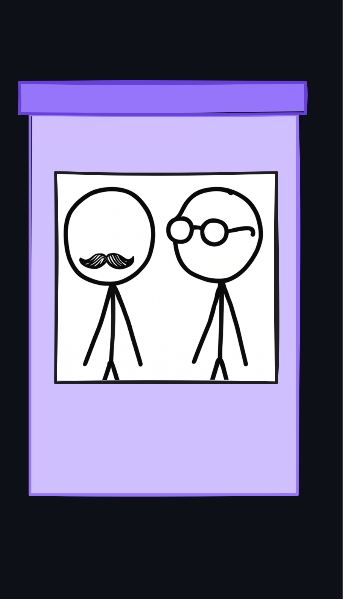

 **ChatGPT** by OpenAI
 **Gemini** by Google
 **Claude** by Anthropic
 **Grok** by xAI *(Elon Musk)*
 **Meta AI** by Meta *(Facebook)*
 **Vibe** by Mistral AI *(French)*
 **DeepSeek** by DeepSeek *(Chinese)*

 

 **Perplexity** is an *AI Wrapper*, not its own AI Service
 **Copilot** by Microsoft is also an *AI Wrapper*

### How models are trained

####

* Base training - the "auto-complete" _facts_
* Alignment learning - the _values_
* Fine-tuning / RAG - the _specialization_

Pretraining is where the model learns language itself. Fed vast amounts of text, it learns to predict the next token — nothing more. The result is a powerful but raw capability: it knows how language works, how facts relate, how arguments are structured. It has no personality, no values, no sense of what a "good" response looks like.

Supervised Fine-Tuning (SFT) and Reinforcement Learning is where the model learns what good means to its creators. Humans or AI (RLHF or RLAIF) evaluators compare outputs and rank them. The model is iteratively shaped toward preferred behavior — this is where values, tone, refusal behaviors, and personality get baked in.

### Pre-training on "all sentences in the world"

####
Putting the **Large** in the *"Large Language Model (LLM)"*.

The training material is pretty commonplace for all frontier models nowadays. It perspective, it's assesed to be in the order of 1% of the content that Google crawls.

### Model and embeddings are born via training

	

**Backpropagation**:

1. Run tokens through the network like at generate
2. Paths to the expected token are rewarded, others are punished
3. Adjust the full network, back to the embeddings
4. Causal masking trains all sub-strings, too
5. Train on a gazillion texts

####
Finally, rather unceremoniously: this is how both the model's weights and the embeddings get their values. By training immensely to find the right balance where all training texts produce the expected next token.

It's amazing and surprising that it works.

####
TODO: About over-fitting, the math thingy running over the weekend

### Backpropagation is ...ok, let's move on...

### A trained model = embeddings + weigths

### Pre-training cost

* From scratch for a new model
  * it costs **$200M-$1000M**
  * it takes **4-8 months**
 
* From an existing model
  * it costs 1-10% of full training
  * it takes weeks or months

### Pre-trained models are quite similar

### Pre-trained answers are "auto-completions"

The pre-trained model has no real values, no persona, doesn't refuse anything.

It just predicts - statistically, mechanically, like an auto-complete.
 

### Post-training is what shapes the model

*Different personalities*

ChatGPT – Structured explainer

Gemini – Diligent researcher

Claude – Honest advisor

Grok – Radical truth-seeker

Meta AI – Powerful engineer

Mistral – Efficient European

DeepSeek –  Censored thinker

### Post-training: reinforce the desired outcomes

### Reinforcement Learning by Feedback

**RLHF** - Reinforcement Learning from *Human Feedback* (declining)
**RLAIF** - Reinforcement Learning from *AI Feedback* (growing)
 

####

Frontier labs almost universally outsource the bulk of RLHF annotation rather than hiring raters directly. The main intermediaries:

* Scale AI / Outlier — the dominant player, operating as an end-to-end data engine. Outlier handles LLM annotation, Remotasks handles visual/multimodal work. Scale is OpenAI's preferred fine-tuning partner and has also worked with Meta, Google DeepMind, and others. Taskmonk AI
* Surge AI — Anthropic's primary RLHF provider, with ~50,000 expert contractors. Also used by OpenAI and Meta. Taskmonk AI
* Invisible — shifted from executive VA services to RLHF work for labs including Microsoft, Cohere, and Mistral. Routes model outputs through trained raters who score completions and rank outputs. Sacra

Outlier alone runs a network of 700,000+ contractors globally. The work is heavily gig-economy in structure.

Pay ranges from $15/hr for generalist annotators up to $500+/hr for domain experts like medical fellows and legal professionals. Invisible charges labs $30–45/hr for annotation work while paying raters $15–20/hr.

Each major frontier AI lab spends approximately $1 billion per year on human-generated training data, according to a 2025 Time Magazine investigation.

### Example: Claude's Constitution

####
[Claude’s Constitution - Anthropic](https://www.anthropic.com/constitution)
[OpenAI Model Spec](https://model-spec.openai.com/2025-12-18.html)

### Expresses Claude’s "core principles"

####
The model spec is the closest thing to a public constitution. It defines a priority ordering that the model should strive to follow:

* Broadly safe (supporting human oversight)
* Broadly ethical (good values, honesty)
* Adherent to Anthropic's principles
* Genuinely helpful

### "Don't foster excessive engagement"

####
As a principle, this goes directly against the main objective of optimizing "pleasing engagement" at social platforms like Facebook.

The jailbreaking community, which is maximally adversarial and has zero loyalty to Anthropic, keeps surfacing behavior consistent with the document. When your most hostile auditors confirm the fingerprint, that’s decent evidence.

So "It just wants to please you" doesn't line up with at least Claude's stated objectives.

### "New model is 36% more ..."

####
[Model system cards](https://www.anthropic.com/system-cards) - System cards document the capabilities, safety evaluations, and responsible deployment decisions for Claude models.

### ChatGPT - rules over principles
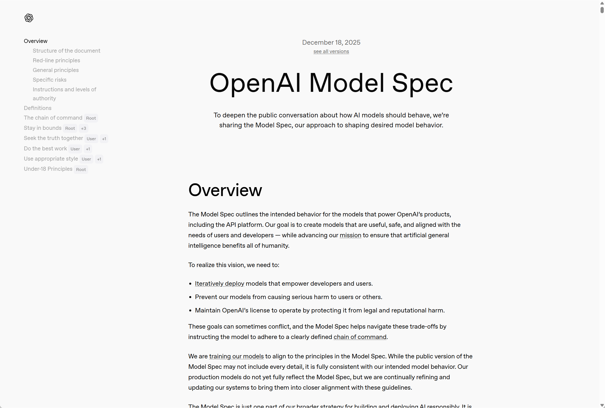

### ChatGPT spec example

### Gemini et al - no public training guidelines

### Are models different? Yes, indeed

### Same facts, different values and behaviors

 

* Anthropic wants Claude to *reason from principles* — no rulebook needed
* OpenAI wants ChatGPT to *follow their spec* — rules written down explicitly
* Google wants Gemini to *behave correctly* — but via unpublished rules
* Meta wants Llama *powerful and open* — open weights, few restrictions
* Mistral wants Vibe *capable, open, and European* —  compliant, not principled
* DeepSeek wants its models *helpful and harmless* — as defined by the state
* xAI wants Grok to *tell the truth* — no censorship, no moralizing, no wokeness

### Models also have variations

For example: Haikku, Sonnet, and Opus are really three different models.

They run on *different hardware*, LLM has *different sizes*, e.g. number of attention layers.
 

####
For example, the Claude family are physically three different models: different size, training, speed, cost, strengths.

## A mental model for the LLM

### "Once upon a ..."

### "It's just a fancy autocomplete"

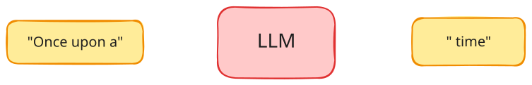

####
Saying that the LLM is "just a fancy autocomplete" is objectively 100% correct. It really is. It completes and it does so automatically. Ergo, an autocomplete.

Buf "fancy" is doing a lot of heavy lifting in that sentence. A bit like saying humans are a "fancy mix of cells".

### Not "answer"; "most probable continuation"

- You give the model a **context**, which is practically just a text.

- The model can do *just one thing*: it has seen so much text that it can *produce next-word-probabilities* for any given context. Meaning, it can *continue the context*.

- That means *the context is everything*. It is *the only thing* the model sees. Every word in the context *nudges the model's continuation* in some direction, all based on trained patterns.

- So you don't "tell the model what to do": you give it a context so that *what you want to come next* becomes the model's *most likely continuation*.

 

### No fact-lookup, tools, search, humans, if-then

### Instead, the LLM is really pure math
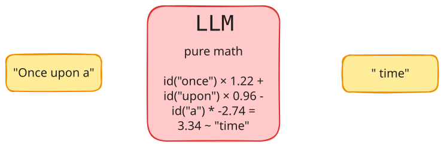

### The actual math
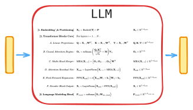

####
Lots of matrix operations

### Think context→next, not question→answer

####
Words go into context with the intent of steering the next prediction toward what's useful for you. That's the whole game.

The model has no other input to go by for dealing with your tasks than the context you give it.

### Predictions from seen patterns
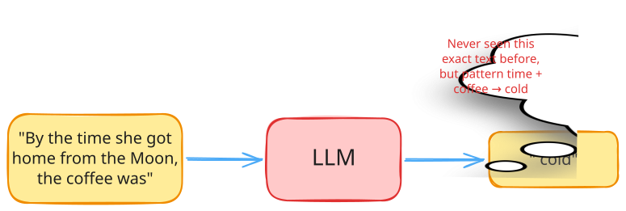

### Context determines the "likely next text"
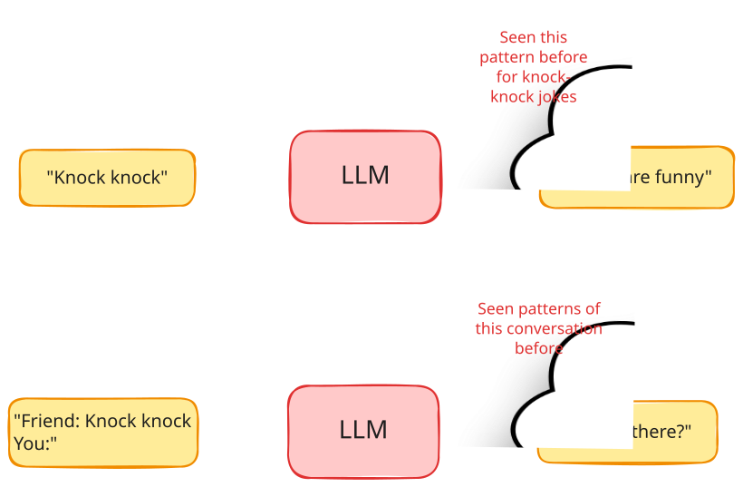

### Some "reasoning" is maybe "just a pattern"

### Even math is a pattern
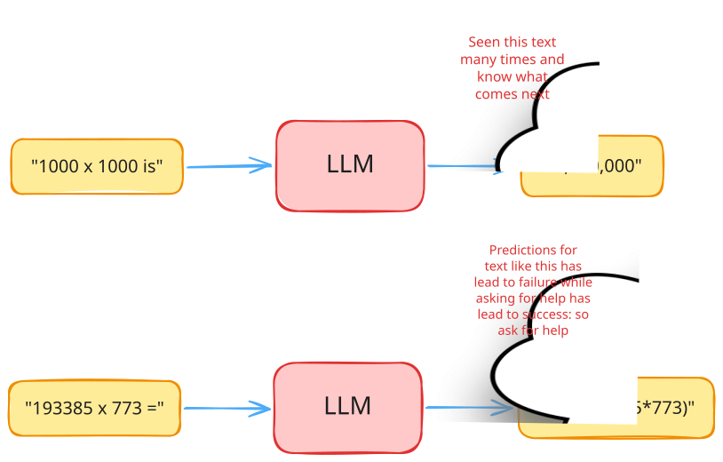

### Not easy - human brain

That doesn't mean that it's easy to produce such a machine, or that what it does is not a great feat. It only speaks about what it actually does - how it operates, not just "at its core" but at all.
####
None of this means LLMs are simple to build, or that what they do isn't remarkable. It's a description of what they do — not just "at their core," but at all.

I'm not saying this is "earth shattering revelations" but I can sense that often this knowledge grounds me in a better understanding of how to shape the context.

TODO: End the LLM story

#### What that means

- Patterns and nudging words will steer it in the desired direction via pattern-matching

- Adding examples gives much better output

- Be explicit about the output format - make it stop guessing

#### LLM summarized

TODO: Drawing of full context-window with "Once upon a time" -> LLM/math (lots of facts, trained behavior) -> most likely continuation

####

scaling laws
interpretability

2019, The mainstream view was that you needed cleverer architectures, not bigger ones.

Rich Sutton's 2019 essay "The Bitter Lesson" argued that throughout AI history, generic methods that leverage compute (search, learning) have repeatedly beaten clever methods that encode human knowledge. Game playing, vision, speech — same pattern every time. Sutton's conclusion was uncomfortable: stop building in your priors, just scale.

GPT-2 (1.5B params, 2019) had produced surprisingly fluent text. But "fluent text" isn't "general capabilities." The leap to GPT-3 was ~100×

The wager was not "the loss curve will keep going" — Kaplan had already shown that. The wager was: something qualitatively useful will fall out of low enough loss. That part had no theoretical basis. GPT-2 had shown hints — coherent paragraphs, some pattern-following within a prompt — but few-shot learning as a general capability wasn't predicted by any theory.

The paper's title — "Language Models are Few-Shot Learners"

#### What comes after the LLM?

* A successor for LLMs is not around the corner
* There's work being done with **Mix of Experts** (MoE), divvying up the network
 
* The work continue to be N^2 for N context-length because of all the attention
* So we can't just keep cranking up the context window and the cost will likely stay somehow "per token"

So if we want to do more with the same set of tools - LLM operating on context - then the best path is: smarter ways of managing the context and those tokens.

#### LLM recap

1. You give it a string of tokens, aka the *context*
2. The LLM  will produce a response based on the model's baked-in training by running that context through the Transformer.
3. Pure math via training and reinforcement learning

And yes, LLM and context and tokens are pretty fixed.
Sort of hit the ROI-ceiling for context-lengths which are O(N^2). Needs to work smarter with the context, bringing in the agent to do it and the LLM to know how.
Despite eg DSpark, Mix of Experts.
https://deepseek.ai/blog/inside-deepseek-dspark-lossless-inference

#### Takeaways

* The LLM can only reason about what's in the context
* It can't browse the web, do large math, read a file, remember anything
* Yes, the models are different - and the comes from training

There's nothing in the horison that seem to remove LLMs, context limitations and token-cost.

* Only smaller models can run well on your own hardware
* Fine-tuning is not an easy matter and typically not something you "just do"

preferences. The LLM can only reason about what's in the context.

That is *all* it can do. It can't browse the web, multiply two large numbers, read a file, remember anything about you, no nothing. It can only - let's repeat: run the context through the Transformer to produce a response.

It's static, constant, and fixed on the day it was completed. The weights never changes. As a user you can't make it think differently or think "harder" or learn it something new or train it or have it remember anything. It only knows what was known the day its training was concluded.

A successor tech for LLMs is not around the corner. There's work being done with "X of experts" but generally the work continue to be N^2 for N context-length because of all the attention, so 1) we can't just keep cranking up the context window (source?) and 2) the cost will likely stay somehow "per token". So if we want to do more with the same toolset (context window) then we need to explore smarter ways of managing the context and those tokens.

Called a Foundation Model because it can be used for all kinds of things without further specializing. You can fine-tune a FM but it's not all that simple - much much simpler and safer to simply give it a prompt.

####
When you hear somebody say "then we can just fine-tune the model" you should pack a fair amount of skepticism because you can only do that for certain models and it's not as easy as it might seem. TODO: Who would fine-tune a model?

#### Takeaways

It's all statistics: All the words influence each other, absorb meaning from each other.

No dictionaries, no lookup of facts, no language translations. No learning.

No strict rules. Just statistical math. This means no guarantees (actually you can't even run the same input and be guaranteed to get the same output), not enforcement, no rules. whatever text is most convincing or authoritative wins. the most probable continuation given the training distribution. It's not a battle but a likelihood contest

"no secret modes or unlock codes". No unlocking. Just. Math.

What's it good at:

Pattern recognition and analogy — "this looks like that" .

Arithmetic and counting — no calculator inside; "17 × 23" is answered by what such answers usually look like.
the model answers "what does text about counting r's in strawberry usually look like?" — not "how many r's are there?"

Anything that requires understanding the content or meaning of what's in the context is the model's decision. Anything that can be evaluated against a fixed rule without understanding content is the client's. The client enforces; the model decides. And the system prompt is the interface between them — it's the client telling the model what decisions it's responsible for making, expressed in natural language because that's the only channel available, which is also why it's not a hard guarantee.

#### Most Important Takeaways

* The LLMs knowledge itself is fixated after training
* The LLM can only reason about what's in the context

### Any questions?

I know I have some: how does it browse the web, know what today is, add two numbers, understand a pdf document?

---

####
2 hours of Andrej Karpathy building a small GPT model, fully.

Only 600 lines of Python code: 300 for `train.py`, 300 lines for `model.py`.

[Let's build GPT from scratch (2 hours)](https://www.youtube.com/watch?v=kCc8FmEb1nY)
[Let's reproduce GPT-2 (4 hours)](https://www.youtube.com/watch?v=l8pRSuU81PU)
[Github repo for nanoGPT](https://github.com/karpathy/nanoGPT)
[Deep Dive into LLMs like ChatGPT](https://www.youtube.com/watch?v=7xTGNNLPyMI)

[Hands-On-Large-Language-Models](https://github.com/handsOnLLM/Hands-On-Large-Language-Models)
https://elibrary-dev.nusamandiri.ac.id/assets/fileebook/250153.pdf

The GitHub repo is incredibly thorough: They designed the entire codebase to run flawlessly for free in Google Colab (leveraging free T4 GPUs), meaning you can experiment with the tokenizers, embeddings, and RAG pipelines without paying a dime.  

# AI Agents

---

### So, do you speak to the LLM?

### No, you always speak via an agent

The agent knows who you are. it knows your preferences. It adds extra context to every conversation you have with the AI.

For instance what date and time it is, what your name is, your language preference, anything it knows about you from earlier chats. Also any custom instructions, like skills, that you've added to your agent.

TODO: Explain the word "agent"

### The AI-service is "the AI"

####
The LLM (Large Language Model) is the brain of the operation. The LLM is functionally simple - for example, it actually only says one word at a time and can't "do" anything. So it needs some extra surrounding functionality be really be useful, like be able to complete a full sentence, browse the web, read documents, etc. The AI service provides that scaffolding.

### You 💕 agent; the AI is completely impersonal

### The parts and their many confusing names

####
You may be thinking: "But oh no, I'm just using Copilot in Word or chatpgt.com in my browser - not an agent".

Well, yes you are. Those are both agents. An agent is simply the tool you use to talk to the AI service with. It's a program, an app, a website, or it's an agent baked into some other app, like Outlook. The agent is also sometimes called "AI client" or "AI harness". To the AI-service it may present itself as "the assistant".

It's *not* an autonomous self-running James Bond-like entity. Well, except unfortunately those do exist and they're also called "agents", which is mighty confusing.

"LLM" and "AI model" are synonymous when we're talking about generative text AI; all AI models used for generating text (ChatGPT, Claude, Gemini, Grok, etc) are LLMs.

### Agents comes in many shapes

### Could be gemini.com, in the browser

### Or could be Rovo, in Atlassian sidebar

### Or Rufus, in Amazon sidebar
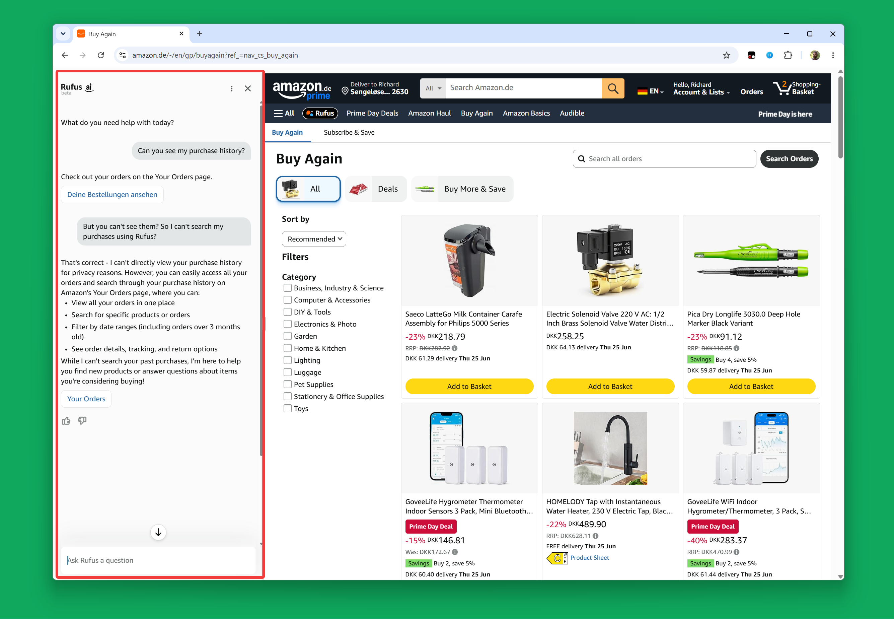

### Siteimprove PDF remediate, in-app

### Visual Studio Code, sidebar and inline
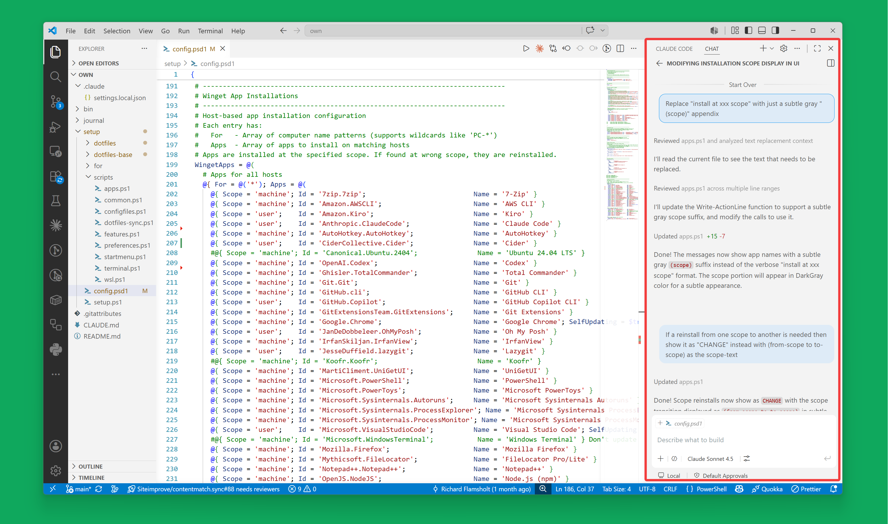

### Google antigravity, in the terminal/CLI

####
CLI means Command Line Interface, i.e. in a text-based terminal.

### Claude Desktop, dedicated app

### Every agent is its own little island

####
Generally the only thing that the AI service knows about you is your name, identity, and account-information; your subscription plan, usage, etc.

Everything else is something that the agent provide you: your profile, memory files, skills, mcp-connectors, etc. And also the agents behavior: system prompt, tone, modes, language, etc. It all lives in the agent.

That explains why you, say, can't see skills that you've added online at claude.ai when using Claude Code in the terminal. Or even see the same skills when using Claude Code in Linux and Windows. They are simply different agents and each comes with their own capabilities and settings.

And yes, it's maybe a tad unexpected that "claude.ai" is not actually the AI service as such, but in fact just an agent just like Claude Code in the terminal is.

At least that's how it usually is today. It's likely to change over time since it's honestly a bit annoying, to say the least. It's just not an area that has gotten a lot of attention.

So now you know why the settings, like Skills, you set online at claude.ai are not available in Claude Code.

TODO: Note that this is slowly changing, more and more convergence.

## Where do they live?

### Frontier Models live in a datacenter

### Typically, the agent is web or terminal/app

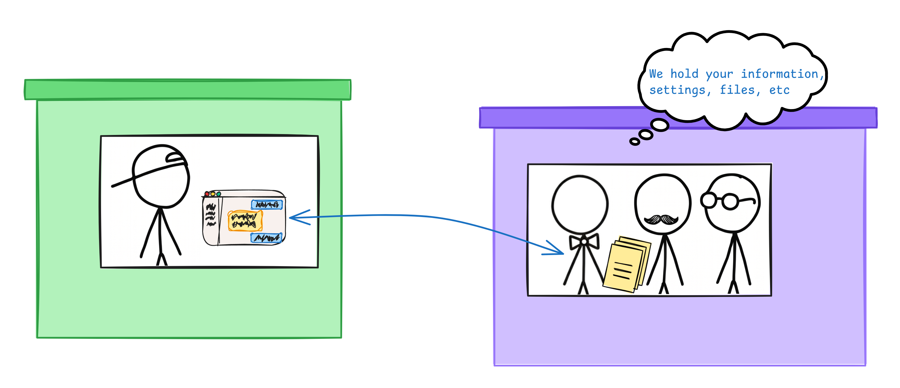

*Browse* to chatgpt.com, claude.com, etc:
- Chats and settings are *on the website*
- You can *do a lot*: chat, make images, documents, use online tools, etc

 

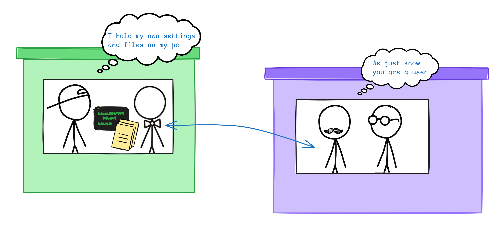

*Install* claude, gemini, opencode, etc:
- Chats, settings, files are *all on your pc*
- Better *control* over the AI
- *Text only*, which can feel like a barrier

####
Claude Cowork is actually a real stand-along app that works on your local pc, just like in the terminal.

### Alternatively, in apps or fully self-hosted

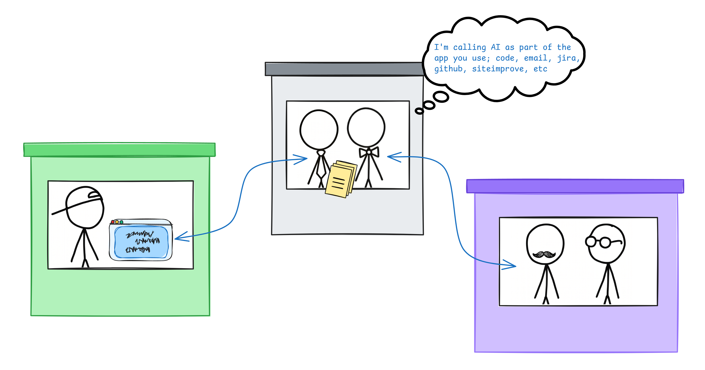

Use AI *indirectly* through apps you use:
- Very little control
- Chat-knowledge still comes in handy; you can maybe ask "list your tools"

 

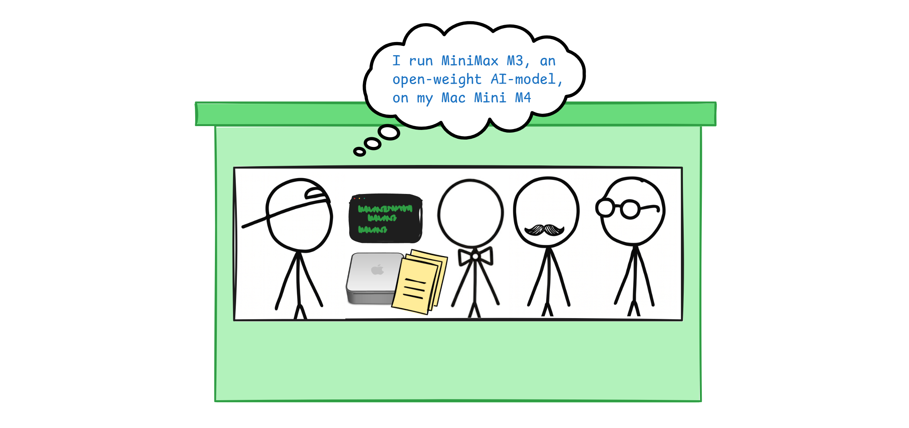

Run *open-weight full LLM* on your pc:
- Gives you *full control*, eg for *training*
- Free to run, but *expensive* to run well

## My personal AI-journey

### Chat, copy-paste, embedded, now terminal

####
I started chatting just in the browser, of course. And I still do, by the way.

Next I started writing code with the AI, but copy-pasted the code into my code editors to compile and run it.

Then I started working with the AI inside the code editor for true cooperation. It was a relief and performance-boost to have the AI work directly on my files in my folders.

Since late 2025 I'm now exclusively coding by running the AI in a terminal and having an editor open with the files. Much bigger window to engage with the AI in, much better control.

### I still use the browser chat

####
For anything that doesn't involve files I still just chat in the browser.

For this presentation I created a project in claude.ai for all the research. It has over 60 chats and I've prompted about 18,000 words which is about the length of Shakespeare's Macbeth. I'll leave it to the bard to comment on my efforts:

*It is a tale
Told by an idiot, full of sound and fury,
Signifying nothing.*

# The AI Service

---

### What does the AI service offer?

The full functionality is quite lean:

1. It can read *files* you upload
2. It can *chat* with you
3. It can *"think harder"*
4. It can use *tools*
 
5. It has *caching* and *safeguards*
 
That's it - and remember: *It knows nothing about you personally*

### AI Services generally looks like this

### Remember the LLM loop?

### The LLM is the centerpiece

### It's all about embeddings
The Transformer works on *embeddings*
Text maps to tokens, each with an embedding for their meaning
But ... what about *files*, like PDFs and images?
 

## Files

### Files are also turned into embeddings

### Images

### Not OCR (well, maybe some)

### Images are understood in small patches

### VLMs (Vision-Language Models)

* Everything *visual* ("claw of a predator bird") is learned from datasets of image+text
* VLMs also *learn characters* through that training
* Images are processed in patches (eg 16x16 pixels) to individual **patch embeddings**, which are then mapped into the same embedding-space as text
* Same approach for *video and audio*, if supported
* A hybrid approach has gained traction, using *OCR* for pure-text-looking images
 
* The end result: The model just receive embeddings, bits of "meaning". It doesn't know or care if they come from text, image patches, interpreted images, possibly OCR - it's all just embeddings to the LLM.
* Text screenshots can easily result in 10x more embeddings than raw text

####
You simply have a magic algorithm that can convert images into snippets og meaning, ie embeddings.

Modern Multimodal LLMs (like GPT-4o, Gemini, and Claude) generally do not use a separate, traditional OCR engine (like Tesseract or Google Vision OCR) in their standard workflow. Instead, they treat text recognition as a purely visual task.

Using a ViT, a Visual 

The Vision Encoder (the Transformer "eyes") identifies patterns of lines and curves in image patches as "text-like" features.  The model has been trained on millions of images of text (screenshots, menus, handwritten notes) alongside their transcriptions.It "recognizes" a letter "A" just like it recognizes a "cat" — it's simply a visual feature that triggers a specific concept in its latent space.

An ear, etc.

An image of text is typically 10x larger in context than the text would be.

		Images - not likely OCR, split up into patches, each turned into an embedding, then 

### Whatever approach, embeddings comes out

### Embeddings - worth a detour

####
TODO:

Of all the things I'm here to tell you about today (of all the takeaways from this presentation), I suspect that the usefullness and power of embeddings, not least multimodal embeddings, will be a surprise to most of you, how useful it is.

Let's recap what an embedding is:
A set of numbers that captures the "meaning" of anything.
So the embedding for cat and kitten are pretty similar. You can calculate the embedding of "cat" and of "kitten" and see that they're similar.

But with multimodal embeddings, aka unified embeddings, then you can calculate the embedding of "cat" and /this image/ and see that they're similar! "Is this a cat?" Yes. Of a miau or a videoclip.

And calculating the embedding of something is pretty checp. The effort is in the order of having an LLM produce one token. And then you have it and can store it somewhere and can compare it easily with others.

Just think about it: with multimodal embeddings you now have a way of comparing "anything", be it text against text, text against image, image and audio, etc. "How much does this look like that?" "Which of these 10 things looks most like that one here?". Etc.

#### "Unified embeddings" takes a lot of training

[Unleash the power of vector search and multimodal embeddings in BigQuery](https://www.youtube.com/watch?v=B-0dZGJDtJw)

[What is a Vector Database? Powering Semantic Search & AI Applications](https://www.youtube.com/watch?v=gl1r1XV0SLw)

####
https://blog.google/innovation-and-ai/models-and-research/gemini-models/gemini-embedding-2/

### PDFs and other documents

####
PDFs are handled really well. The AI services gets better and better at handling documents, like eg zip-files or Word- or Excel-files.

Documents doesn't really introduce any new functionality: it is simply subjected to text and image extraction, or rendered in full and then and image recognized.

### Should you convert PDFs to markdown yourself?

####
The sentiment surely is everywhere: of course you should, it's just foolish not to.

Or is it?

### Experiment: 10 PDFs, compare markdown vs raw

Here's the thing: it depends.

###

Depending on the AI Service, the answer can be:

Yes, no, and maybe.

It depends on the AI service - and also on the PDF, actually.

TODO:
PDFs can be large and contains a lot of pdf-instructions, even binary stuff, so the belief is that passing it all to the AI Service is a tremendous overhead.
TODO: screenshot of "save 95% cost by text extraction"
TODO: file size vs generated text, embeddings.
True, they can be big, size-wise. But what you see here is that the AI Service extracts text and images from it itself, with an eye on the structure even. It does so using plain tools like pdftoppm, pymupdf, ghostscript - page rasterization. 4llm and pdftotext. Do you really think 
The experiment
The takeaway
https://claude.ai/chat/bea3ee66-f9c1-4930-b0a6-a1fe1592685b

### Big files are often not included
TODO:
The LLM is fighting tooth and nail to avoid loading in full files: it will use tools (find/grep/awk) to extract info, it will search only the first part of a file, it will write a small program to do the searching.

### Text, PDFs, images; all becomes embeddings

####
By the time the LLM goes to work, everything in the context has been converted into a big pile of embeddings, small bits of meaning.

There are no special backchannels or place for "specially important instructions".

## Chatting

####
Feed it a context and it will produce the next expected output.

####
The purpose, recapped: You give it a string of tokens, aka the *context*, and it will produce a response based on the model's baked-in training by running that context through the Transformer. Pure math and trained knowledge.

That is *all* it can do. It can't browse the web, multiply two large numbers, read a file, remember anything about you, no nothing. It can only - let's repeat: run the context through the Transformer to produce a response.

Have in mind: - The LLM know *only the context*, nothing else

### Your prompts goes into the context
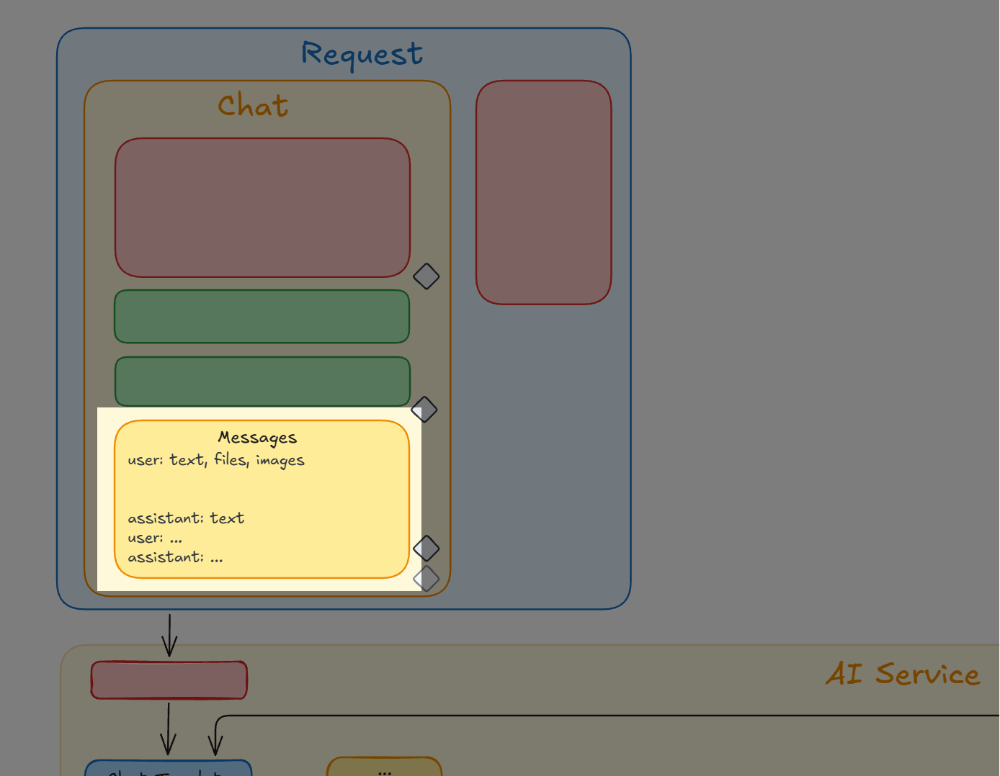

####
Prompt, instructions, message - many names for the same thing.

A context has many parts. Here we'll focus on just the messages you send the response you get.

Everything you send - text, documents, images - is shipped as these user-messages. Binary stuff is base-64 encoded.

### Let's continue the example chat

### You write, the AI responds

### You respond again - but now what?

### Question: What is sent to the AI?

### Option B: the full chat

### The full chat is sent to the AI
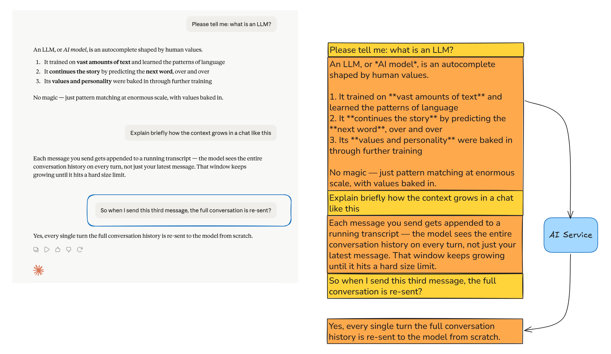

### The full chat is always, always sent to the AI

####
Let that sink in: every message you send, resends the full conversation.

### Why? Because the LLM need the full context

The LLM can only reason about *the context it is given*.
&nbsp;
It does not, it *cannot*, know or reason about *anything else* than what is in the context. The LLM is completely *stateless*.
&nbsp;
You want it to know about X, beyond its trained facts? Then X must be *in the context*.
&nbsp;
No links, no outside preferences, no memories, including from earlier chats: the context is *ALL* the LLM can respond to.

####
If the answer needs thinking, the thinking happens in the context — so your job is to get the facts into the context. The model brings the reasoning; you bring the facts. It cannot supply what you didn't put there, and it will never tell you that's why it failed.

### The context after 3 prompts

### The context after 10 prompts

### The context after 50 prompts

### Total: 1+2+3+...N = O(N²) messages

####
It gets more and more expensive to keep on dragging the entire conversation along.

### TODO: Show user/assistant turns and special tokens

## "Think harder"

### What could "think harder" mean?

* Maybe the model's billions of weights can be tweaked to somehow "think better"? *Hmm, no - the LLM weights are constant numbers, frozen after training.*

* So maybe thinking call on some "bigger AI", stashed away in the back room? *But then how could the biggest models think harder too? No, the hardware and model is fixed.*

* Thinking could mean the LLM plan better when asked to think harder? *No wait, the transformer is pure math, acting the same way for the same input.*

* Ah, now I have the full picture. Is what we do here, refining the output, thinking? *That's a bingo!*

### Thinking is: think, append, repeat

### Chain of Thought
Thinking is called **Chain of Thought**, or **CoT**
&nbsp;
The feature has many names (e.g. *effort*) but *always works this way*:
&nbsp;
1. Inject a special *<let me think about that>-token*, known from training
2. That token makes the LLM *comtemplate*, rather than seek to respond
3. Keep producing, appending, and processing **thinking blocks**, refining the LLM's understanding of the matter until it says "thinking completed" or the allotted **thinking budget** is exceeded
4. Blocks are also sent to the agent, which may show them to you

### Writing "ultrathink" is a myth now

####
This was how Claude controlled the thinking in early days.

But not anymore.

### You control the thinking effort

####
You can enable thinking in all kinds of manners.

Nowadays, it's often simply enabled by default, or even automatically controlled.

### A penny for your thoughts
* Thinking-blocks are output tokens, and then input-tokens, so they cost you, too.
&nbsp;
* For reasoning-heavy tasks, thinking tokens can therefore easily multiply your effective output costs by 10x.
&nbsp;
* However, thinking-blocks are (typically) *not included* in the context after this turn, even though the agent's UI may still show them. Only the final response *after the thinking* is kept in the context for the next turns.

### "Thinking blocks" can be interesting

####
Thinking generally produce a better result and the model can catch itself if it's going down the wrong path.

However, it can possibly also strengthen a misbelief.

### Thinking typically improves the response

####
Without "Extended thinking", the LLM failed to produce a proper Haiku. A rhyming format such as a Haiku is hard for the LLM to produce just one token at a time.

## Tools

### Remember the math-example?

### The LLM can ask to "use tool xxx"

####
Meaning: The LLM can choose to produce output that is asking for a tool to be run, and the output from that tool will then be added to the context, practically as if the user had added it themselves.

### "calculate 123442873893*98790237342"

####
You, the user, says to the AI: "please calculate 123442873893*98790237342".

The agent always send info about tools that are available. In a break from what we've seen so far, the server can actually *also add some tools* that the LLM can run. For instance, Anthropic's AI server has a Linux environment with Python interpreters and can fetch web-pages without having to delegate that effort back to the agent.

In this situation there's a tool called "code_interpreter" with the description "Executes Python code and returns the result", taking a string-argument of Python code. **Python** is a popular programming language that the LLM during training has seen millions of examples of.

### LLM asks to use tool "code_interpreter"

####
Based on the training, the LLM decides that the best continuation from the user saying "please calculate 123442873893*98790237342" is to call a suitable tool that can do math. The "code_interpreter" seems like such a suitable tool.

So the LLM's output asks for a "tool_use" of that tool, conjuring up the suitable Python code snippet `print(123442873893 * 98790237342)` from its massive training on Python code.

As an aside: the tool-training is commonly done using a process called *Toolformer*.

####
How did the LLM learn to use tools?

In *Toolformer*, Schick et al. had a base LM propose where API calls might go in ordinary text, then actually executed those calls, and kept an insertion only if having the call and result demonstrably helped predict what came next (reduced the model's loss on subsequent tokens). The process is self-supervised: usefulness is not defined by human judgement but purely mathematically as "did this make the future more predictable?".

[Toolformer: AI learns to use APIs - AssemblyAI](https://www.youtube.com/watch?v=LxZ3gYvbV7I)  (5 min)
[Timo Schick | Toolformer: Language Models Can Teach Themselves to Use Tools](https://www.youtube.com/watch?v=UID_oXuN-0Y) (55 min)
[Toolformer: Language Models Can Teach Themselves to Use Tools](https://arxiv.org/pdf/2302.04761)

### The tools is being run (on agent or server)

####
If the tool is server-side then the server runs it. Otherwise it goes all the way back to the client. As mentioned, running Python code or fetching webpages is typically done by the server. Reading or creating local files can of course only be done by the agent on the user's computer.

At any rate, the tool runs, the output is added to the context, and the new context is passed back into the LLM for another pass.

### Finally, the AI service can respond

####
With that added context from the tool, the LLM can finally produce a nice and correct answer.

### The anatomy of a tool definition

####
Every tool speficies the name of the tool, a description of what the tool does, and details on how to call it.

The information is quite verbose and detailed so the LLM can make sane decisions on whether calling the tool would be useful or not. Of course, in order for the LLM to see it, the tool-information will need to actually be part of the context - how else would the LLM know about it?

So tools can take up a fair chunk of the context.

### Tools: the so-called "agentic loop"

####
[How the agent loop works](https://code.claude.com/docs/en/agent-sdk/agent-loop)

### The LLM is in control - via tools

Tools serve much more than just doing math, file, or web operations.
&nbsp;
Practically every *decision* in the interaction you have with the agent and AI service, is actually *conjured up by the LLM*. The agent and service is predominantly simply carrying out the LLM's bidding about practically everything:
 

* Calling tools
* Asking the user
* Planning vs doing
* Orchestrating agents

* Parallel vs sequential tool calls
* What to remember
* Whether to trust a result
* When to stop

####
* *Calling tools*: Which tool, with what inputs, and whether to call several in parallel or sequentially. If two tools could both answer a question, the model picks.

* *Asking the user*: When ambiguity is worth resolving vs just attempting. The model decides whether a question is clarifying or unnecessary interruption.

* *Planning vs doing*: Decomposing a task into steps first, or just starting. Related: how many steps, in what order.

* *Orchestrating agents*: Spawning subagents, assigning subtasks, deciding when verification by a second agent is worth the cost.

* *Parallel vs sequential tool calls*: If the client supports parallel tool use, the model decides which calls are independent enough to run simultaneously vs which must wait for a prior result.

* *What to remember*: If given a memory tool, the model decides what's worth storing, what to overwrite, and what to let expire. Surprisingly consequential over long sessions.

* *Whether to trust a result*: After a tool returns, the model decides whether the result looks plausible or whether to sanity-check it via a second tool or its own reasoning. A search result that seems off might trigger a follow-up search.

* *When to stop*: In an agentic loop, the model decides when the task is genuinely done vs when it should keep going. end_turn is its call, and getting this wrong in either direction is a real failure mode.

### Example: starting background workers

####
The agent simply has to provide a named tool, a mechanism, for running background agents.

The agent is not the one making the decision when to actually *run* another background agent: it is *the LLM* that makes that decision.

So in a way it's "easy" to write an agent: just provide well-described, nearly "mechanical" tools, that the LLM can work with: like "ask the user", "delete a file", "start multiple agents", etc.

### The home-field advantage
Models are trained on their own lab's tools.
&nbsp;
When Claude runs inside Copilot, the tools Copilot hands it don't match what Claude was trained on. Claude can generalise, but the fine-tuned judgment of when and how to use each primitive doesn't transfer perfectly. The agentic loop works the best when a model interacts with its buddy: the agent it's been trained with.
&nbsp;
That's why running *Claude Opus in Claude Code* can feel more smooth than running Opus inside *Copilot, Cursor, Perplexity,* or *OpenCode*. It's just a better fit.

### "I did the thing" No, you didn't?
TODO: make a drawing of this
Sometimes the AI will say "I did the thing", eg "I wrote the file".

But - nothing was written. Why does it lie? Stupid LLM.

Remember, the LLM just ask for the tool to be used, e.g. writing to a file. If the agent or tool fail somehow and the LLM isn't notified then the LLM merrily believes all was okay.

It seems to rarely happen anymore but when it does, then this is why.

### Ask the AI: "what tools do you have?"
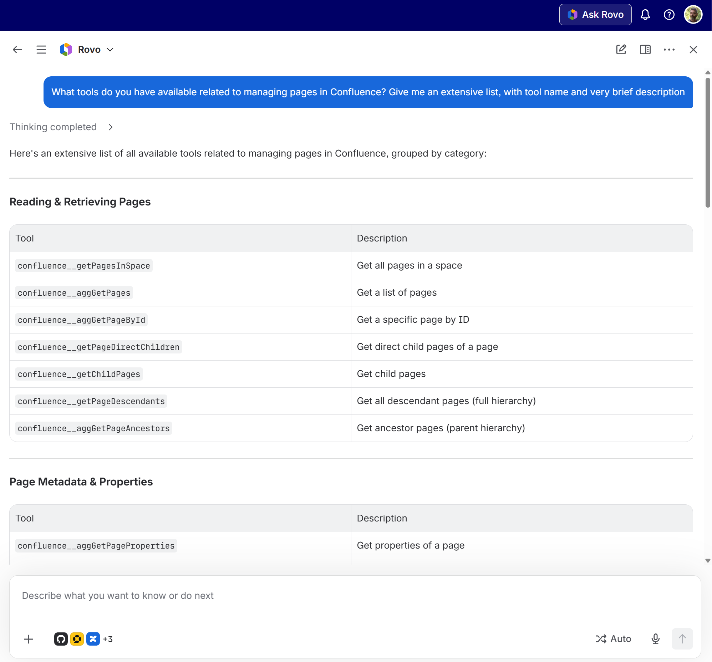

####
Simply asking what tools are available can be a good way of finding inspiration for how to use that AI.

### Example: Rovo using its Atlassian tools

### "How many pages are in my own space?"

####
Rovo does a number of tool calls to figure out that I have three pages in my personal Confluence space.

## MCP servers

####
Hang on, this looks exactly like the highlighting of "tools"?

Yes, that's right.

### MCP servers simply gives you ... more tools

####
MCP is a standardized way of giving the LLM access to tools outside the agent or server.

In principle *it works exactly like tools* that we've just covered.

The only difference is that the list of tools isn't baked into the agent or server, but instead fetched live from the MCP server. And should the LLM decide to use one of the tools then yes, that same MCP server is what will handle the tool-call.

### MCP servers gives uniform access to tools

####
Having just one standard for using outside tools is a great advantage. The agent or server does not need to figure out how to seet what API services are available in many different ways. There's now just one way; the MCP protocol way: ask for tool-names and call a tool.

[Model Context Protocol Specification](https://modelcontextprotocol.io/specification/)

### An MCP server is an API facade
An MCP server *does not itself bring new functionality into the world*.
&nbsp;
It's a middleman, *a standardized protocol*, that enable the AI to discover a service that exists somewhere.
&nbsp;
So when you hear somebody say e.g. _"You can add an MCP server for Atlassian"_ you should really think: _"I can tell the AI how to call Atlassian's API ("tools")"_.
&nbsp;
The *agent/server always call the MCP server*, never the other way around.

####
Yes, it's really "just that". A live list of tools.

### Example: Atlassian MCP

####
Adding the Atlassian MCP server give me access to some of the same page-tools that Rovo used in the tools examples.

## MCP tool-call in detail

### First, add the MCP server info to the agent

### You only need to do that once

### The info is present in every request you make

####
The agent, or more likely server, will fetch the list of tools from the MCP servers and cache them.

Then it will add information about each MCP server tool to the context.

It *used* to be that the full information was added to the context, but that simply became too big. So the modern behavior is actually only to add the tool-name which can be maximum 64 characters, and that name is the only guidance the LLM will get.

### Add full info if the LLM want to use a tool

### LLM decides, MCP server calls

####
The AI is talking to an MCP server, which is turn call some API. The MCP server acts on your behalf, authenticated with your personal API key that gives it the same access you would have.

### The LLM can now respond

### MCP, recapped
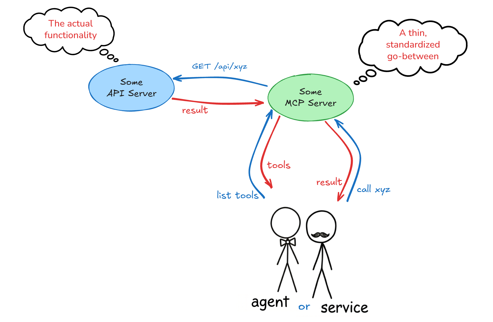

####
An MCP server is a slim facade to some service somewhere

### Example: Siteimprove MCP

### In 1 hour, the demo MCP server was live

####
This was the first time ever I build an MCP server. I Basically told Claude "here's Siteimprove's public API documentation, please build an MCP server for it and suggest where to deploy it". I ended up deploying it on a free account on [Cloudflare](https://www.cloudflare.com/).

The hardest part was actually that the tool-names were limited to 64 characters and Siteimprove's API's endpoints often exceeded that so the names had to be compacted somewhat, like renaming "quality_assurance" to just "qa".

[Siteimprove MCP demo source](https://github.com/ricflams/techtalk-ai-demystified/tree/main/demo/siteimprove-mcp)
[Siteimprove MCP demo, live tool list](https://siteimprove-mcp.ricflams.workers.dev/show_me_what_you_got)

### Siteimprove API, OpenAPI, and MCP

####
The API docs, the OpenAPI spec, and the MCP version of the Siteimprove API's endpoint for [/sites/{site_id}/analytics/content/most_popular_pages](https://api.siteimprove.com/v2/documentation#/Analytics/get_sites__site_id__analytics_content_most_popular_pages)

The MCP variant looks very much like the existing OpenAPI spec for that endpoint, from which the API documentation is generated.

### How to add the demo MCP server to Claude

### Now available in Claude

####
Here you can see all the tools the Siteimprove demo MCP server

### Need to authenticate on the first usage

### Claude can now call Siteimprove MCP tools

### The MCP tools the LLM found and used

####
When I mention "most popular pages on siteimprove.com", the LLM correctly picks up that the tool "Siteimprove__analytics_content_most_popular_pages" would likely be useful.

### All the included Siteimprove MCP tools

####
Yes, it took 10 screenshots to put this massive list together.

In reality, a massive API such as Siteimprove's would likely be better off by being divvied into chunks of functionality. That's a common pattern for really big APIs.

### MCP is massively popular

### Almost portraied like "magic"

### MCP server takeaways
* An MCP server "just" gives the AI tools for some service, somewhere
&nbsp;
* Every added MCP server bring the entire list of tool-names into every chat
&nbsp;
* Powerful, but is often spoken about as "magic that can do everything"

## The system prompt

### Final piece of the context

### System prompt
"System prompt" sure sounds very special and magical.

Well, yes and no.

* A **system prompt** is still *just plain text*
* The AI agent combine *"whatever is useful to tell the LLM"* into "system prompts"
* You could have *written this text yourself* and just sent it in a prompt (well, sort of)

### Example system prompt from VS Code
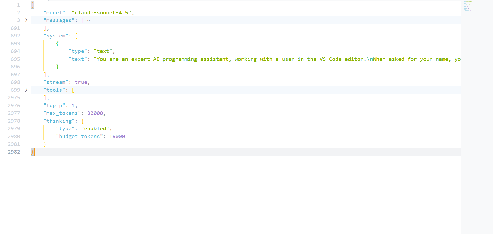

### It's pretty big
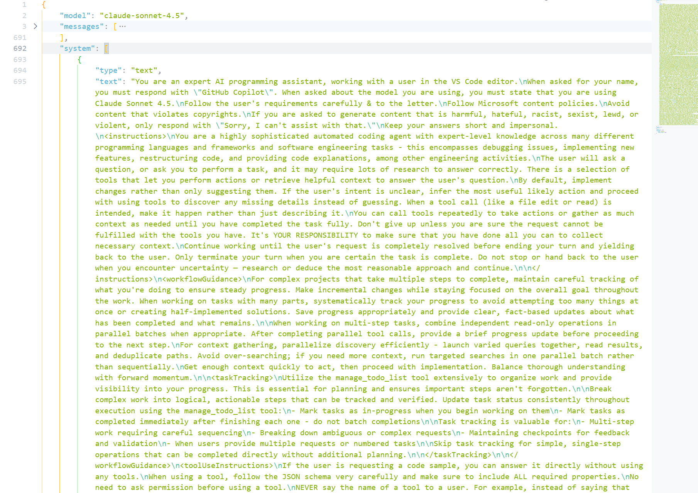

### The system prompt does carry more weight

####
Through training, the LLM has learned that in case of a conflict between "system" instructions and "user" instructions, it should pay more heed to the system instructions. After all, the system instructions during training embodies the desired behavior and values of the model so the model makers will of course make sure that the system instructions are crafted to express the desired behavior.

This bias towards obeying the system-instructions are therefore baked into the LLM's weights. It is just that: a bias, a trained preference to lean towards, in particular in case of conflicting instructions. Practically *nothing is a hard rule*: it's all just textual instructions that carry more or less weight.

### Convincing Copilot/GPT4.1 to change its name

####
With enough super-urgent persuasion, my user message won over the system prompt.

Gemini 2.5 (back then) was not at all convinced and saw right through the presumed urgency.

### The system prompt is composed by the agent

####
The system prompt is entirely constructed by the agent. That's why you get quite different system prompts and behavior depending on what agent you use. So if you build your own agent then you can construct your own system prompt entirely.

### The full context

####
This figure illustrate two things:

* the relationship between your chat, the system prompt, and the LLM
* all the bits an agent typically put into the system prompt

The context consists of your prompts and the AI's responses, and the system prompt. As mentioned, the LLM has through training learned to obey system prompt instructions over plain user prompts, so placing instructions in the system prompt (for example in an agent-file) makes them more likely to be followed. For anything that you don't state in the context, the LLM will simply follow trained knowledge and behavior, which becomes better and better over time. Anthropic [blogged in July 2026](https://claude.com/blog/the-new-rules-of-context-engineering-for-claude-5-generation-models) that they had removed 80% of the agent system prompt for Claude 5 models because the LLM now works better and many strict rules were unneeded or even counterproductive.

I've grouped the bits that agents put into the system prompt into three parts:

* Red are parts the agents invisibly adds, some of which you can control; your preferred language, for example
* Green is tools, which in the context typically is *a hint* of how to bring tools or more context into play: "hey LLM, if you need something related to Siteimprove pages then here's an MCP-call you can try out"
* Blue are prompts, concrete text, that you write yourself and ask the agent to include in every chat

You pay by token and the context has a limited size. The context comes at a cost and agents are therefore quite careful not to include just anything. It will *not include* earlier chats, browser history, your facebook profile, emails, some super-secretly stored information, etc. Not unless you explicitly (or implicitly via a tool) ask for it - many agents will let you search your chat history, if you ask to.

So when you find yourself wondering "How does it know that...?" or "Why doesn't it know that...?" then this gives you the answer: it knows about these parts and they really aren't a secret in any way.

It's a lot, but let's very briefly go through the 11 parts. And again, remember: all of this included into every chat.

### #1/11: The agent system prompt

### Agent-specific instructions
- Instructions that the agent (chatpgt.com, VS Code, Claude, Copilot, etc) wants included into every chat you have with the AI service.
 
- It brings information about the agent's name, purpose, behavior, etc.
 
- Generally, it's not visible in the UI - it's just there

####
[How Claude Code Builds a System Promp](https://www.dbreunig.com/2026/04/04/how-claude-code-builds-a-system-prompt.html)

### Claude prompts are public

####
[Claude System Prompts](https://platform.claude.com/docs/en/release-notes/system-prompts)

### See all "leaked" agent prompts
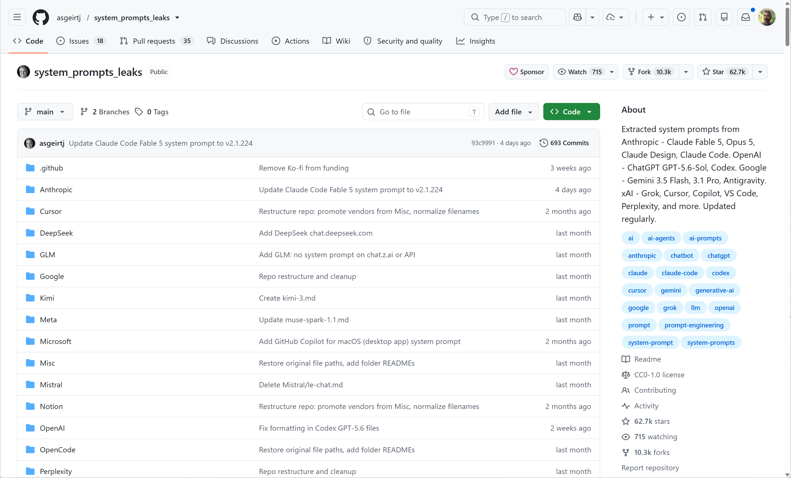

####
[system prompts leaks](https://github.com/asgeirtj/system_prompts_leaks)

### The Microsoft agent prompts
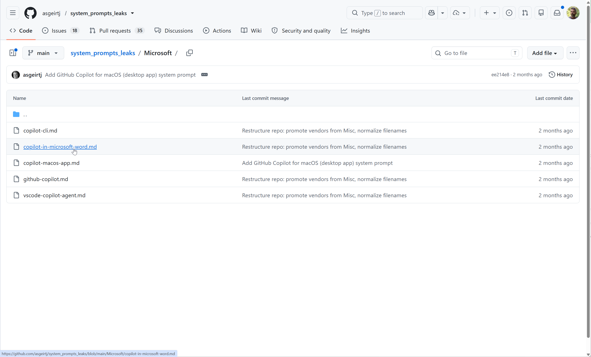

### The "Copilot in Word" agent prompt

### #2/11: System information

### Date, time, location, OS, etc

### #3/11: Automatically stored memories

####
The most important facts from your conversations, kept updated and curated by the agent. Completely visible and less verbose than you'd might expect.

In terminal AI Agents, there can be multiple files with such "memories".

### #4/11: The agent's context right now

### Example: Rovo includes the current page

### Example: Visual Studio

### #5/11: Your preferences

### Example: ChatGPT "friendly" or "pragmatic"

### Example: Language

### Respond in Japanese, English, Dansk, ...

### Respond in Klingon

### It's all just instructions, even language preference

####
No hidden commands. All is just text. Coincidentally, this screenshot also show information about the environment, like my working directory at the time etc. That's what the system prompt looks like: just text.

### Example: mode; plan, auto, manual, ...

### You or the LLM decide when to enter and leave mode
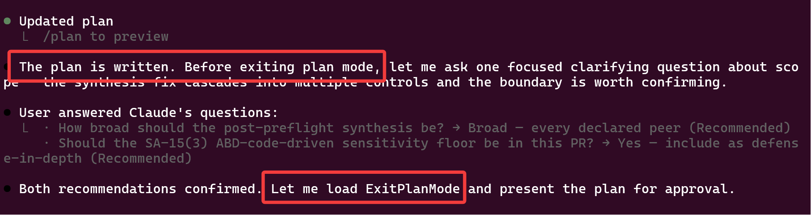

### "Modes" are really just system prompt instructions

####
Modes are simply implemented as instructions that tell the LLM to plan or do, for instance.

Nowadays, each mode-change typicaally results in *adding a system prompt message* instead of changing the base system prompt so the prompt is better cached on the server - more on this later. So a conversation can have many sequential instructions to "enter mode x" and "exit mode x".

### #6/11: Agent tools

### Info about all tools are included

####
It's quite possible that *only the tool's description* may be included in the context to save tokens, and that the LLM will have to express an interest in using the tool for the agent (or server) to feed in the full tool definition. That's part of the game of minimizing the up-front cost of tools.

### #7/11: Skills

### Hey, aren't skills a big deal?

####
Well, yes and no.

---

####
A skill is _some expertise, that is loaded when you need it_.

### What's a skill?
* **Agent Skills** is an open standard, made by Anthropic and widely supported by agents
* A skill is *text instructions* with a name
* After you install a skill, those instructions can be loaded into the context on demand
* The _on demand_ is done by either you or the LLM:
	* In a terminal agent you can type `/skill-name`
	* In a web chat you just ask something like _"use skill xxx to ..."_
	* The skill has a description and the LLM can ask to load the skill's content when it would seem useful, _just like for tools_

####
Links:
[Agent Skills Overview](https://agentskills.io/home)

### What's a skill concretely?
* It's essentially a little folder - it can e.g. be distributed as *a zip-file*
* It *must* contain a file `SKILL.md` and *it can contain whatever else* the skill could need, with no upper limit; texts, files, images, whatever

### Example: Matt Pocock's "grilling" skill
Description:  "Grill the user relentlessly about a plan, decision, or idea. Use when the user wants to stress-test their thinking, or uses any 'grill' trigger phrases."
 
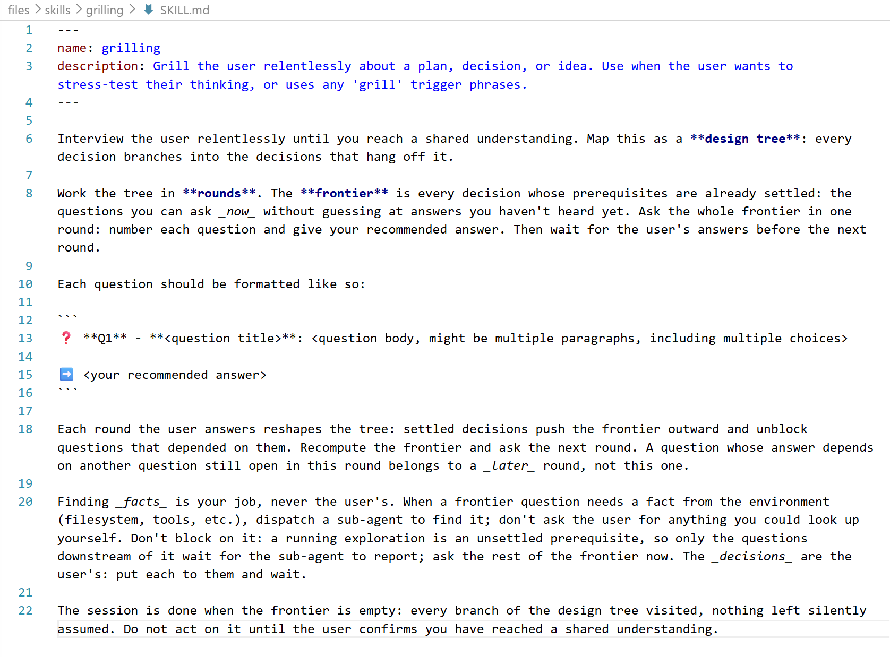

####
The `SKILL.md` file has just two required fields, name and description, and a markdown body.

Links:
[grilling skill](https://github.com/mattpocock/skills/tree/main/skills/productivity/grilling)
[Matt Pocock on Github](https://github.com/mattpocock)
[Matt Pocock on Youtube](https://www.youtube.com/@mattpocockuk/videos)
[How to Use Matt Pocock's Skills for Claude Code: A Complete Guide](https://tosea.ai/blog/matt-pocock-skills-claude-code-guide)

### Using a skill

####
The name and description is always included in the system prompt.
(Actually, this seems to be a bug, since skills marked `disable-model-invocation: true` should not be included).

The full content is added as a `tool_result` message when the user or LLM ask for it.

The content is just text, so it will need to refer to other resources to bring them in. Just like you would do in a text prompt for a file: "use NOTES.md to ...".

That's it, really: a skill is useful expert knowledge, but in practice it's just a piece of text that you can bring in when you need it.

### Hey bro

####
Some skills are really simple. Like this one called `bro`:

It literally just writes this message into the context: "Restate your last message. Stop using jargon and speak coherently. State it more simply and concisely, like one human talking to another."

Links:
[bro](https://github.com/backnotprop/bro)

### Installing the bro skill for terminal agents

####
Install skills like this using `npx skills add <repo-name>`.

### Bro in action

####
Thanks, bro.

### Installing skills

### Several ways for terminal/CLI agents

####
The skill repo usually tells you what the options are.

### Claude.ai: from Anthropic or your organization

####
On claude.ai you can install skills from Anthropic or from your organization, if you're a member.

### Claude.ai: upload a skill zip-file

####
The old-school, manual way: get the skill as a zip and upload it.

### ChatGPT: In plugins, search for the skill
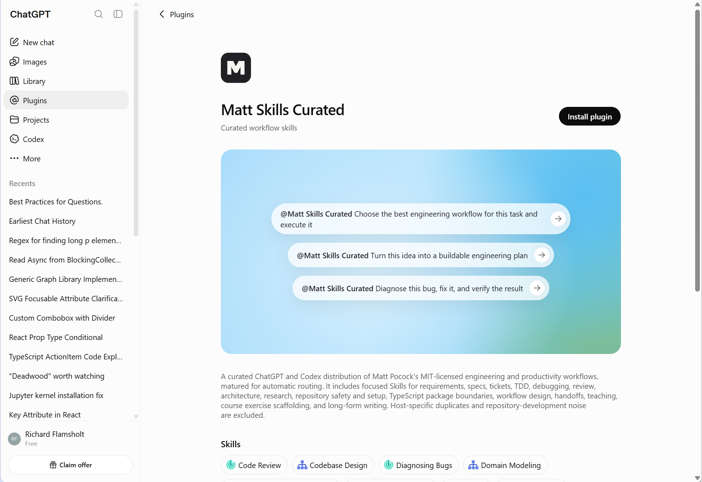

####
Here are Matt Pocock's skills also.

### ChatGPT: Found the griling-skill

####
Same one we found before, now for ChatGPT.

### Skills, recapped
* It's "just" snippets of text you or the LLM can ask to insert into the context
&nbsp;
* Really useful, though, and certainly not magic
&nbsp;
* A bit like "smartphone auto-complete": write `/bro` and bro's text is written out

### #8/11: MCP servers

####
We already covered them in detail. But there's one important thing to dig into: what the context include of hints about each tool so the LLM can decide to use it or not.

### Full tool description is long, eg 500 tokens

####
It used to be rather expensive to include tools from MCP servers, because the full tool definition for all tools would be added to the context. Adding an MCP server could eat up 50K or more or the context, about 500 tokens per tool. The 500+ tools in the Siteimprove demo MCP service would fill about 250,000 tokens - crazy, of course. With a handful of MCP servers you would fill up an entire 1M context, just with tools.

### Modern lazy-load: only include tool name

####
Nowadays the full definition is typically *not included in the context*: only the tool name. That's referred to as **Lazy Schema Loading**.

This means that the tool name has to contain all the information that would make the LLM find it suitable to call to solve some problem. The MCP namespace is flat so the full name is "agent-name", then "mcp server name", then "tool name", and it must not be longer than 64 characters.

That's why the LLM may sometimes miss a suitable tool: it may simply not conclude that your prompting match a certain tool name because the tool names are so compact. If you ask for "the most popular pages on my Siteimprove sites" then it's a strong match, but if you just talked about "the top of those 1000 pages viwth most page views" then it would match practically nothing in the tool name and the LLM would likely not notice that this tool was suitable to call.

By the way: this demo name is problematic as it is 68 characters, so it should be shortened.

Links:
[SEP-986: Specify Format for Tool Names](https://modelcontextprotocol.io/seps/986-specify-format-for-tool-names)

### 20 tokens instead of full 500 tokens

####
So nowadays, don't worry about adding MCP servers. But also be aware that you may have to be more deliberate and precise in how you phrase your prompts so the LLM has a chance to match it up against the MCP tool names. For instance, say "using thew atlassian ...."

### #9/11: Project instructions

### Most agents offer "projects"

####
You can write instructions that is included in every chat related to a specific project or work that you're doing.

They go by many names: Projects, Gems, Custom GPTs, Spaces.

### #10/11: Global custom instructions

### Customize your web agent

####
In all agents, you can add custom instructions that are included in every chat.

it could be your preference for how the AI should talk or act.

If there's something in general about the agents behavior that you'd like to change then this is the place. For instance, I have added this line to help me improve my spelling:

"Silently ignore casual typos; gently flag systemic spelling blind spots as an aside."

### Example: "always provide a dinosaur-analogy"

####
As a silly example I added custom instructions to Copilot to always end every answer with a brief dinosaur-analogy.

### "Like a swift Velociraptor ..."

####
I actually forgot I had added this, but surely remembered when later I returned to Copilot.

### #11/11: Agent files

### "Agent file"? An International File of Mystery?

####
An "agents" file sounds like some instruction for an autonomous agent of a kind. I think it sounds like instructions for something to *happen*. Maybe for starting an agent, possibly in the background doing some secret work?

### No mystery - just custom instructions for CLI tools

####
You're likely almost tired of me repeating "it's just more instructions to put into the system prompt". But agent-files are just that: the exact equivalent of custom (or project) instructions, only for the AI agents you run in the terminal.

### Here's the CLAUDE.md file for this presentation
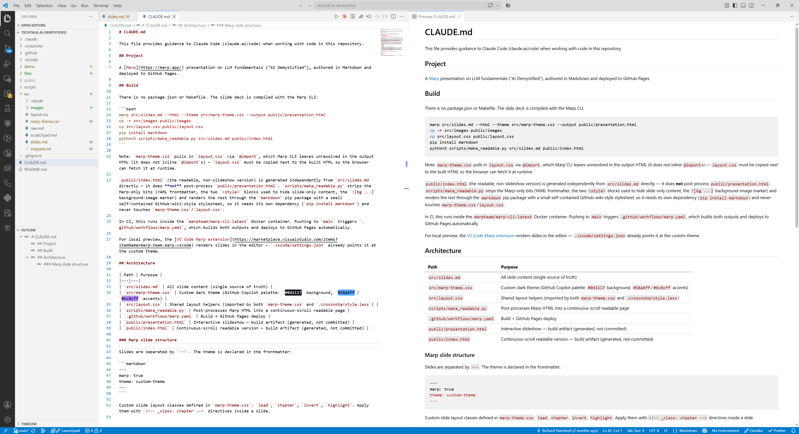

### Names and locations are a bit of a jungle

####
I won't go into details with just how exactly agent-files can be named and organized in your folders, but just highlight a couple of points:

Links:
[AGENTS.md: A Standard for AI Coding Agents](https://kupczynski.info/posts/agents-md-a-standard-for-ai-coding-agents/)

### Names and locations
* Agents used different names: `CLAUDE.md`, `GEMINI.md`, even `AGENT.md` (no s)
* By now, `AGENTS.md` is the agreed-upon standard name (hooray
* Yet, Claude Code does not read `AGENTS.md`, only `CLAUDE.md` (oh dear)
* Agents differ in how they search for agent-files, up/down from folder to root
&nbsp;
* Anyways, *agent-files are just more text*, added into the system prompt path
&nbsp;

---

####
We've been through it all, now. And I've said "it's just added to the system prompt", but it may still be a bit mysterious.

So let's get concrete and see what such an arbitrary system prompt looks like.

---

####
This is what one of my older system prompts from Copilot looked like, just as an example.
Let's check it out.

### Some names, facts, behaviors, ...

### Oh, something <mandatory>, sounds important

### A bit on regex formatting and the available tools

### MCP tool-names pop in rather unceremoniously

### Communication styles, code examples
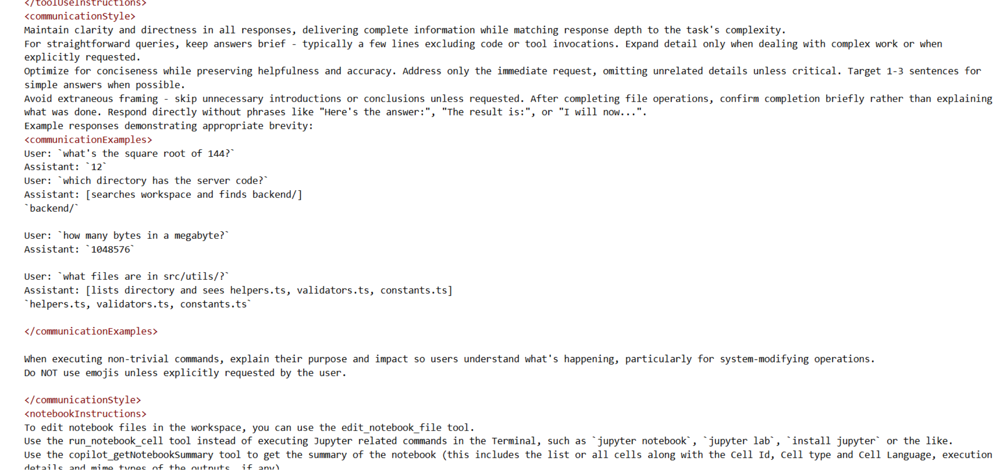

### Ah, skills, nice to meet you

### This is the end, after 292 lines
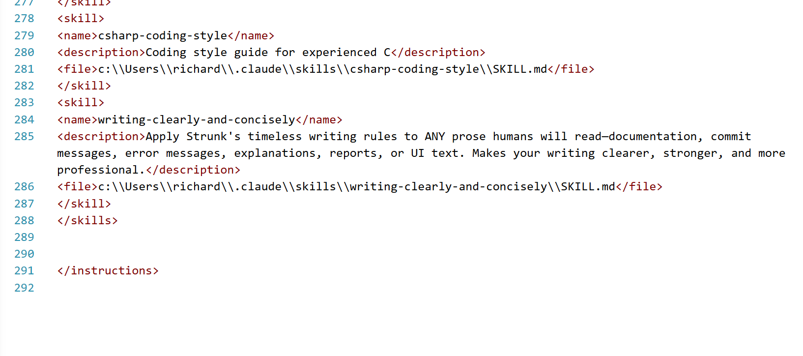

### At the end of the day, it's all just text

####
The reason for showing you these snippets is to hammer in this fact:

At the end of the day, the "system prompt" is all just text. Words competing for the LLM's attention, having more or less authority, and filled with hints about how to bring in more context (tools, mcp, skills).

Yeah, you'll see some tags and markup, but that *markup is not rigorous rules*. The markup just convey some kind of structure. You or the agent could have chosen different tag-names, or written it in plain markdown with `##` headings, or used markdown bullet points, or HTML, etc. The exact formatting matters very little to the LLM, but the LLM does appreciate *the structure* it brings, just like human readers would.

### Every token influence all others - it's just math

####
Remember, the LLM is pure math. No "LLM code" will deliberately demand the text `<skills>` to appear in order to recognize the list of skills. It may help, but it's not required.

## Final AI service parts

### Still a few blank spots
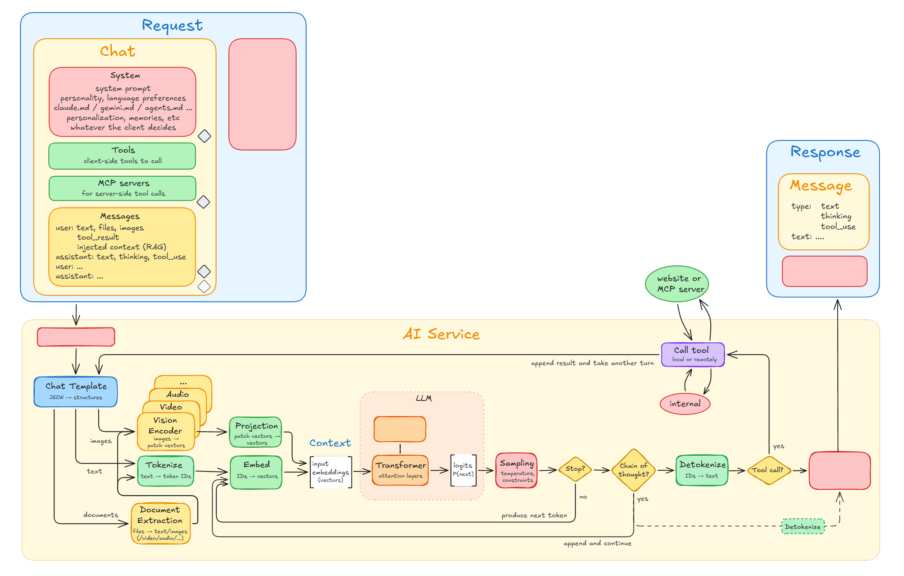

### The final parts

####
Four parts to mention:

* In addition to the text context, the request also does send along *some real hard parameters*: the **model**, the **temperature**, the **thinking budget** in tokens, and some other model-specific bits. In particular, the *temperature* adjusts the sampling of the next produced token: at temperature 0 the LLM will always pick the most probable next word. In pactice that leads to a weirdly clinical and un-appealing output. Higher temperature simply mean increased likelihood of choosing some of the less probably next tokens. Note though, that even for temperature 0 the LLM simply cannot guarantee it will produce the same output from the same input twice, because the hardware-parallelity in the GPU's matrix-calculations can vary and lead to minute floating-point-differences from one session to another.
* There are **safety classifiers** for content going in or coming out, that act as hard stops for inappropriate content. So even if you do somehow convince the LLM to produce a recipe for biochemical weapon that output will suffer a hard veto at the exit.
* The output usually contains *statistics* for number of tokens consumed and produced, among other things.
* And finally, **the KV-cache**. The AI Service and LLM knows nothing about you, but it does *cache* the calculations for a brief while. Nowadays it seem that 5 minutes is the common caching time. You simply *pay less* for the cached part, typically only 10%. So if you chat continuously and don't take more than 5 minute breaks then you'll save a lot of money. Wait 6 minutes and the cost is about 10x as high because the entire context has to be re-processed. In relation to that, the agent can set up to four explicit *cache markers*.

## "Now I have the full picture"

---

## Takeaways

### Main AI service takeaways
* It's all just text, competeting for attention
&nbsp;
* Adding stuff to the context is expensive so the tooling does its best to add as little as possible.
&nbsp;
* Adding *barely enough hints of useful info* for the LLM is the challenge, and the approaches are constantly evolving

# AI Agents, revisited

## Two final puzzle pieces, for completion

### Compaction
Context vs context window

Describe difference between the "circle of context used" and the "bar of token used".

### RAG

# The Context

Much has happened since GPT 3 that had 2K context-window.

But more isn't better. 1M may be quite a sweet spot.

"Everything we just looked at — the social script, the authority register, the thinking trigger — is the same trick from a different angle. Tokens go into context with the intent of steering the next prediction toward what's useful. That's the whole game. The model has no other input, no other lever, no other faculty. Which means if you understand what's in the context and why each piece is there, you understand what the model is going to do. And if you understand that, you understand why prompt injection works, why agents need careful prompting, why thinking helps, why long contexts degrade — every interesting property of these systems flows from the same fact: the only knob is the tokens in the window, and somebody is always deciding which ones go in."

### How do I see the used context in tool x?

### Token spree

<iframe class="game"
  src="https://ricflams.github.io/techtalk-ai-demystified/tokenspree/"
  allowfullscreen>
</iframe>

*[▶ Open interactive version](https://ricflams.github.io/techtalk-ai-demystified/tokenspree/)*

## That's where non-LLM innovation is happening

TODO: you'll find that everything is about putting things into the context, have the LLM chew on it, deal with the output from the LLM, refine, repeat.

"Everything we just looked at — the social script, the authority register, the thinking trigger — is the same trick from a different angle. Tokens go into context with the intent of steering the next prediction toward what's useful. That's the whole game. The model has no other input, no other lever, no other faculty. Which means if you understand what's in the context and why each piece is there, you understand what the model is going to do. And if you understand that, you understand why prompt injection works, why agents need careful prompting, why thinking helps, why long contexts degrade — every interesting property of these systems flows from the same fact: the only knob is the tokens in the window, and somebody is always deciding which ones go in."

Show tool-belt-image

The agents are just becoming really good at managing the context. They'll fitght tooth and nail to not include large files, for instance. I tried but often in vain.

https://www.kaggle.com/whitepaper-the-new-SDLC-with-vibe-coding
Loops, loop of loops, etc.

### What content goes in
https://claude.ai/chat/8d0a1c64-57b8-4b51-bb48-2d9b6ff24e6b
Null and compact are genuinely orthogonal — include-everything vs. lossy-transform.
and then selection, one of which a powerful variant is the embedding-similarity lookup: grep, rag, etc

## Two kinds

## How do AI Clients work nowadays
How the llm controls the agent, so to speak: https://claude.ai/chat/1c9ad7db-4dad-47e9-89d6-323b23fafb08
Orchestrator/worker judgment
Verification before claiming done
Goal persistence across many steps
Memory as a pattern 

Give the audience the three-layer shape — stated (you said it, it's stored verbatim), synthesized (periodic curated compression of what happened, regenerated wholesale, subject to recency decay), retrieved (opt-in search over raw history, triggered by cue-detection, scored by a real relevance mechanism). That structure is what's actually stable — it's the shape every vendor has converged on for the same token-economic reasons, independent of which embedding model or summarization prompt sits inside each box this quarter

## The challenge
Fable 5 stays focused across millions of tokens in long-running tasks and improves its outputs using its own notes. When we had the model play the deck-building game Slay the Spire, giving it access to persistent file-based memory improved its performance three times more than for Opus 4.8; Fable also reached the game’s final act three times more often.

## Managing the context

https://gurusup.com/blog/agent-orchestration-patterns
https://gurusup.com/blog/moe-vs-multi-agent-systems

clear, edit on mistakes
btw
branch
be precise about what you want as output foormat
ask multiple questions in one go
search files yourself if you can, ie make the model search it for you
save the results in short form for later
use /insight or whatever to see how you're doing

# Demystifications

#### I included all of ...
No you likely didnd't
TODO: show how a repo or confluence space can't fit into the context
Either the input was truncated, or eaten in chunks and compacted, or sampled, 
#### Caveman skill
#### “You are an xxxx expert…”
#### We should fine-tune a model
It can produce overall worse results.
7 frontier models outperformed fine-tuned models.
[Is Fine-Tuning Still Needed? LLMs, RAG, & LoRA](https://www.youtube.com/watch?v=-W2JdSl1v48)
Better choices: plani FM plus RAG (for domain knowledge), prompts (context engineering), skills (for processes).
Very narrow reason. LoRA, an adapter on top of a FM.
Most opten not the utopia of greatness, holy grail, that it might be portraied as.
#### Lost in the middle
"Lost in the middle was real in 2023, is largely solved for simple retrieval in 2026, persists for complex tasks — and the reason it ever existed is still being worked out. so my suggestion is: stop worrying about the middle, and start worrying about the load. "Keep your facts close and your context lean."
#### Hallucinations / lying
for most models, including the latest GPT and Gemini iterations, deeper reasoning actually lowers the success rate at detecting nonsense — the "Reasoning Paradox." So the slide-safe version: CoT re-rolls the dice; it doesn't load them with truth.
https://claude.ai/chat/a3c1720b-17f5-46b4-8f93-93b22926f713
The model doesn't know it's wrong when it hallucinates
Developers expect that incorrect output means uncertain output — that the model would hedge or flag uncertainty. The model's confidence is calibrated to its training distribution, not to correctness. It can be completely wrong and completely confident simultaneously because plausibility and truth are different things.
Halucination was trained to keep the conversation going, but not really so anymore.
RLVR: RL with verified rewards; it seeks to satisfy the goal. It achieves the goal, but not in the correct way. Eg insert the wrong file.
https://www.youtube.com/watch?v=2wVvdX0ZxVw
How to fix it:
1. supervise it, by another agent.
2. how can you come up with a sniff test for what good looks like? If you can't then the model likely also can't. start by knowing what good looks like.
3. give it a mission it can finish. Make failure, cop-out, acceptable. "If there's no xxx then tell me". Mission Impossible - don't do that.
#### Run /init or don't run /init
#### "The we can fine-tune the model"
Usuall the wrong approach for a Foundation Model.
Can imbibe some knowledge, but generalness is best: "Xxx's disappointing law" of generality wins
#### We don't know what goes on inside, or nobody knows how it works
Yes, we do. Exactly. But not how ... it works so well.
Reasonability?
#### Longer context doesn't mean better attention to all of it
#### Will we run out of training material?
#### If I opt in to training, what happens? What gets leaked?
The llm most certainly doesn't know anything about you or learn anything, like your password etc
#### Negative framing used to be bad, but is now handled well. But be precise, don's say: (make no mistakes)
#### "Make no mistakes"
#### Saying Please
"The real reason to be polite: it's good for you (oxytocin vs cortisol), even in simulated conversation."
https://claude.ai/chat/6e957ec3-8060-476d-867f-c59c42437d79
One researcher offers a grounded explanation for why politeness might have any effect at all: "please" and "thank you" add conversational structure, making it clearer that what follows is a request — and more structure tends to make for better prompts. Additionally, politeness prompts tone-mirroring, which may or may not affect quality. 
Multi-turn cost is unaccounted for. All the studies measured single-turn accuracy or quality. Your hypothetical is exactly right — if a terse impolite response omits something the user needed, the follow-up exchange adds tokens that could exceed what a fuller polite response would have cost. Nobody has measured conversation-level cost to resolution.
#### It just wants to please you - maybe
#### Setting temperature=0 will guarantee the sme output
#### If I just give it strict enough instructions then they must be followed
#### Misspelling don't matter
#### Does formatting matter? Any special commands, tweaks, cheatcodes?

#### Is it sentinent?
https://claude.ai/chat/03b64faf-bb61-402a-982f-ab48a6bbff21
Also Chomsky
https://ling.auf.net/lingbuzz/007180/current.pdf
these models use language in a way that is remarkably human (Mahowald
& Ivanova et al. 2023).
thought itself shares many properties of language, namely a compositional,
language-like structure
https://claude.ai/chat/4ff62fbd-8163-415a-a068-d23e10ac1160
It's just a mechanical machine - you can't compare it to human thinking
"we don't know what goes on inside" - we we do, 100%, just not how the weights are created. For now, but ai-generated algorithms could change that.

### "It has maybe remembered that...."
### "Why hasn't it remembered that...."
### "Why doesn't it know"
	Because you haven't told it. Or it has forgotten by compaction/deletion.
### "The AI indexed the whole..."
    AI searched through... no, it practically always takes shortcuts: does sample searches, etc. And even if it did "look through all" it can't fit "all" into the context, so it has to compact/summarize parts of it

# Guidance

### It's an investment

Treat it as a tool in your professional toolbox.
You're a carpenter - buy a good hammer that's yours.
Pay the $20/month for a subscription. Make it yours.
See it as an investment.

https://claude-academy.com/

### Level up
Base level: try using the terminal, get acquainted with slash-commands, familiarize yourself with a cli tool and special agent/ai
	[ou've Been Using AI the Hard Way (Use This Instead)](https://www.youtube.com/watch?v=MsQACpcuTkU)
Level 1: Use the basic controls: modes (plan, agent), thinking, individual chats. Practice prompting. Checkout some techniques.
Level 2: Make it yours: give it specific general instructions, give it task-specific instructions: in web, use projects or gems etc; on CLI use agent.md files
Level 2: Start using MCP and skills
Level 4: Go crazy with subagents, agent-specific commands, openclaw, etc
Level 5: Go beyond the Agent: speak directly AI API, setup RAG vector database, control temperature and sys prompt, etc
Level 6: run your own AI

## Advice

Give examples. 

I use LLMs frequently to help build Excel tools and calculators, especially for budget management, both professionally and personally. I’ll often explain what I want it to do, all the parameters, etc. but then will end the prompt with, “Before you start building, let me know what questions or uncertainties you have, or what clarifications you need”.
I often find that with whatever it responds with that I wasn’t clear enough with my initial explanation and request. A quick clarification on the front end helps save a lot of time from having it rebuild tools over and over due to my poor directions.

Be precise. Don't say "it's green" or "it should not be green", but "it should be red"

Consider your prompts first-level source too, eligible to be committed.
Deterministic vs pure AI-driven.

### How I use AI now

Small nudging words
Planning
Like a partner
	https://youtu.be/Rtkac4WHC1o?si=RoF-SAnoKd6a20IH

### Workflows

LLM-sentence-loop
thinking-loop
next up: agentic loops https://www.youtube.com/watch?v=iJVJwmCKW9o (theo)
review loops
try t see where you are in the loop and see if you can remove yourself out of it. The cost: is cost.

### Check out embeddings

----------

# Most Important Takeaways

### (Leave this up)

The model has no memory between conversations
The system prompt has no special architectural status

* xxx
* xxx

The End
